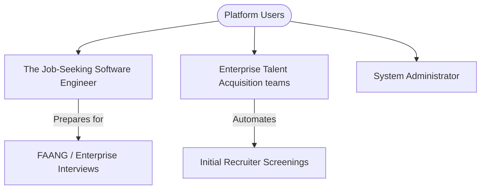

# InterviewPilot AI: Project Vision

## 1. Executive Summary & Mission
**InterviewPilot AI** is an enterprise-grade, voice-enabled AI Mock Interview Platform for Software Engineers. Our mission is to democratize high-quality, personalized technical and behavioral interview preparation by providing candidates and hiring teams with a realistic, low-latency, and highly contextual simulated recruiting experience.

By mimicking the characteristics of an elite human technical recruiter, the system acts as a conversational peer that remembers prior responses, explores past engineering architectures, analyzes live coding execution, maps resumes against Job Descriptions (JDs), and synthesizes actionable feedback loops and adaptive study roadmaps.

---

## 2. Strategic Objectives (Goals)
*   **Democratic Coaching:** Allow candidates to access infinite, expert-level mock interviews tailored specifically to target job descriptions.
*   **Standardized Assessment:** Provide organizations with a reliable, bias-free screening tool that evaluates candidates objectively across hard skills (coding, system design) and soft skills (communication, attitude).
*   **Ultra-Low Latency Conversational Loop:** Target sub-second end-to-end voice latency (Speech-to-Text -> LLM reasoning & Memory Retrieval -> Text-to-Speech) matching natural conversational pacing.
*   **Provider Agility:** Decouple from any single LLM or TTS/STT vendor, ensuring operational resilience and optimization for cost, latency, and capabilities.

---

## 3. Product Scope
### 3.1. In-Scope Features
*   **Dual Voice Mode (Real-Time Conversation):** Multi-modal conversational interface with natural barge-in (interruption) capability using WebSockets/WebRTC.
*   **ATS & Parser Engine:** Automated resume parsing (PDF/DOCX) and job description crawling, deriving ATS match scores and skill gap matrices.
*   **Technical Evaluation Suites:**
    *   *Coding Mode:* Fully integrated Monaco Editor paired with a sandboxed remote execution engine (Judge0) to execute code against visible and hidden test suites.
    *   *System Design & Architecture Mode:* Parsing and questioning on active GitHub repositories, README files, dependency graphs, and architecture decisions.
*   **Multi-Tier Conversational Memory:** A unified memory state machine integrating session cache, short-term history, long-term memory embeddings (pgvector), and a relational profile.
*   **Multi-Provider AI Gateway:** A resilient routing gateway allowing fallback configurations among OpenCode, Claude, Gemini, OpenAI, DeepSeek, and local models.
*   **Insight Engine:** Automated markdown-formatted grading report and a dynamic, personalized learning roadmap linked to detected weak spots.

### 3.2. Out-of-Scope (Future Phase)
*   **Synchronous Video Assessment:** Full facial gesture tracking, eye tracking, and posture analysis (slated for Phase 2).
*   **Direct ATS Sync Integration:** Out-of-the-box integrations with third-party ATS platforms (Workday, Greenhouse, Lever) via direct writeback APIs (slated for Phase 2).

---

## 4. Market Positioning & Personas

### 4.1. Core Personas
*   **Candidate (Software Engineer):** Needs highly realistic, stress-free mock interviews. Wants custom, actionable advice on where their coding or communication style fell short, structured study plans, and historical progress trackers.
*   **Recruiter / Hiring Manager:** Seeks to deploy consistent, high-fidelity technical mock screens for internal employee evaluation or candidate pre-screening to eliminate scheduling bottlenecks.
*   **Platform Administrator:** Needs monitoring on LLM spend, system latency, error rates, prompt template effectiveness, and API gateway health.

---

## 5. Architectural Principles & Technology Choices
The system is governed by standard enterprise design patterns:
*   **Clean Architecture & DDD (Domain-Driven Design):** Strict segregation between the Core Domain layer, application services, repository layers, and adapter interfaces.
*   **Event-Driven Communication:** Asynchronous processes (resume processing, GitHub ingestion, analytics logging) use messaging queues.
*   **Resiliency (Circuit Breaker & Fallback Patterns):** Deployed within the AI Gateway to handle provider failures gracefully.
*   **Stateless Services:** Scale horizontally across Docker-managed clusters.

### Core Stack
*   **Frontend:** React, Vite, TS, Tailwind CSS, Framer Motion, Zustand.
*   **Backend:** Node.js, Express.js, TypeScript, Socket.IO.
*   **Databases:** PostgreSQL with pgvector extension, Redis for session cache and speed matching.
*   **Integrations:** Cloudinary/Supabase (Resume/Project storage), Judge0 (Sandboxed code execution).

---

## 6. Success Metrics & Latency Budgets
To deliver a human-like voice experience, the platform enforces strict performance boundaries:

| Step | Operation | Target Latency | Max Allowable Latency |
| :--- | :--- | :--- | :--- |
| 1 | Speech-to-Text (STT) Chunking | 150ms | 300ms |
| 2 | Prompt Assembly + Memory Retrieval | 100ms | 200ms |
| 3 | LLM Next-Token Output Start | 200ms | 400ms |
| 4 | Text-to-Speech (TTS) Generation (Streaming) | 150ms | 300ms |
| 5 | Network Playback Buffer Sync | 100ms | 200ms |
| **Total** | **Roundtrip Conversational Turn** | **700ms** | **1400ms** |

---

## 7. Risk Analysis & Mitigation Strategies
*   **Risk 1: Prompt Injections & Jailbreaking.**
    *   *Mitigation:* Input cleaning, strict formatting bounds within the AI Gateway, and dual-LLM moderation checks on toxic or system-command payloads.
*   **Risk 2: Multi-Provider Downtime & Token Rate Limits.**
    *   *Mitigation:* Dynamic round-robin and priority routing in the AI Gateway with fallback to high-throughput, low-latency providers (Groq/Ollama).
*   **Risk 3: AI Hallucinations in Technical Grading.**
    *   *Mitigation:* Hybrid verification. Coding solutions are executed inside real compilers (Judge0) rather than evaluated strictly via LLM parsing.
