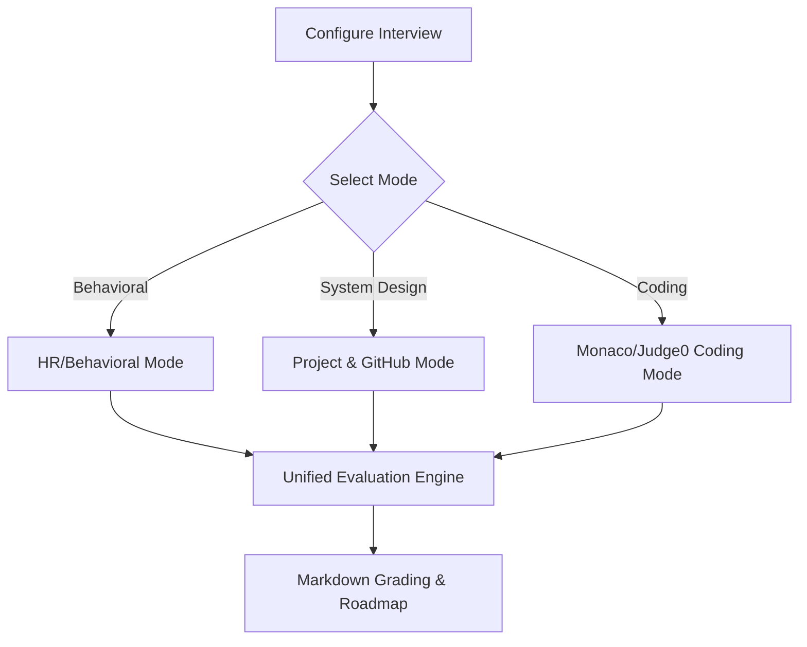

# Product Requirements Document (PRD): InterviewPilot AI

## 1. Document Overview & Context
This Product Requirements Document (PRD) outlines the user-facing capabilities, technical requirements, and functional specifications for **InterviewPilot AI**. The system provides real-time voice, behavioral, and coding mock interview simulations for software engineering candidates, generating grading reports and roadmap milestones.

---

## 2. Target Audience & Personas
*   **Candidate Clara (Mid-level Full Stack Engineer):** Prepares for senior backend roles. Needs targeted practice on system design and database indexing. She needs granular feedback and visual roadmaps to bridge her skills gaps.
*   **Recruiter Richard (Enterprise Talent Coordinator):** Wants to pre-screen 200 candidates for a Python/React role without manually scheduling phone screens. He needs an ATS compatibility score, dynamic follow-up screening, and a summary dashboard.
*   **System Admin Sarah (DevOps Engineer):** Manages API usage across OpenAI, Gemini, and OpenCode, keeping a close eye on system token costs, latencies, and uptime.

---

## 3. Epics and User Stories

| Epic ID | Epic Name | User Story |
| :--- | :--- | :--- |
| **EP-01** | Resume & JD Intelligence | *As a Candidate Clara,* I want to upload my resume and paste a target Job Description so that the AI can customize my interview specifically to my profile and the role requirements. |
| **EP-02** | ATS Matching | *As a Recruiter Richard,* I want to see a matching percentage and missing skills comparison between the candidate's resume and job description to filter out unqualified resumes. |
| **EP-03** | Conversational Voice | *As a Candidate Clara,* I want to have a real-time voice conversation with the AI interviewer, including the ability to interrupt the AI when I need to elaborate or correct myself. |
| **EP-04** | Technical & Coding | *As a Candidate Clara,* I want to write code in a mock editor, run tests, and receive immediate code execution results and algorithmic complexity feedback. |
| **EP-05** | Memory Engine | *As a Candidate Clara,* I want the AI to remember what I said earlier in the interview so that follow-up questions feel logical and progressive. |
| **EP-06** | Analytics & Insights | *As a Candidate Clara,* I want to receive a complete feedback breakdown (communication, coding correctness, design skills) along with a step-by-step learning roadmap. |

---

## 4. Detailed Feature Specifications

### 4.1. Resume & Job Description Parser
*   **Input formats:** PDF, DOCX, TXT (resumes); raw text and URLs (job descriptions).
*   **Parsing Details:** Extraction of years of experience, primary skills, framework familiarity, academic background, and project descriptions.
*   **ATS Score Generation:** Semantic matching algorithm comparing the resume vector with the JD vector, returning an overall score (0-100), list of missing keywords, and match feedback.

### 4.2. Conversational Voice Engine
*   **Interface:** WebRTC and Socket.IO for low-latency full-duplex audio stream processing.
*   **Speech-to-Text (STT):** Continuous transcript generation.
*   **Barge-In (Interruption):** The client-side voice activity detection (VAD) stops the playing audio track and signals the backend to cancel the current LLM synthesis pipeline immediately when a user begins speaking.
*   **Text-to-Speech (TTS):** Streaming response audio chunks to the browser dynamically using an audio player buffer.

### 4.3. Multi-Mode Interview Simulator
The engine supports four interview modules, selectable by the user or dynamically suggested based on the target JD:

*   **HR / Behavioral:** Prompts based on STAR (Situation, Task, Action, Result) methodology.
*   **Project & GitHub Analyzer:** Reads a public repository URI, maps project directory, processes selected code files, and asks questions based on architecture patterns found.
*   **Coding Mode:** Renders a Monaco Editor in the browser. Supports writing in JavaScript, Python, Java, Go, and C++. Runs code using a remote sandboxed Judge0 cluster.

### 4.4. Memory Engine
*   **Session State:** Tracks active session parameters (e.g., active question index, code submissions).
*   **Long-Term Memory:** Encodes key metrics (frequent syntax errors, communication stutters, design strengths) and saves them using `pgvector` embeddings to customize future interview paths.

### 4.5. Feedback and Roadmapping Engine
*   **Structured Grading:** Scoring along four dimensions: *Technical Correctness, Communication Clarity, Architectural Design, and Behavioral Competency*.
*   **Roadmap Generation:** Generates a structured roadmap detailing specific topics to study, relevant resources, and recommended code challenges to close identified gaps.

---

## 5. Non-Functional Requirements (NFRs)

### 5.1. Performance & Latency
*   **Audio Turnaround:** End-to-end voice latency must not exceed 1.4 seconds.
*   **Code Execution:** Sandboxed code runs must return stdout/stderr results within 3 seconds.

### 5.2. Scalability & Availability
*   **Simultaneous Sessions:** Backend must handle 10,000 active WebSocket/WebRTC voice channels simultaneously using horizontal scale-out of voice handler pods.
*   **Availability:** 99.9% uptime target for the Core API gateway.

### 5.3. Security & Compliance
*   **Data Protection:** Encryption of resumes and voice recordings at rest using AES-256 and in transit using TLS 1.3.
*   **Isolation:** Code runtimes must be isolated within sandboxed containers with strict egress firewalls to prevent network attacks or resource exploitation.

### 5.4. Portability
*   **AI Gateway:** Pluggable interface supporting OpenCode, Claude, Gemini, DeepSeek, and local inference servers.
