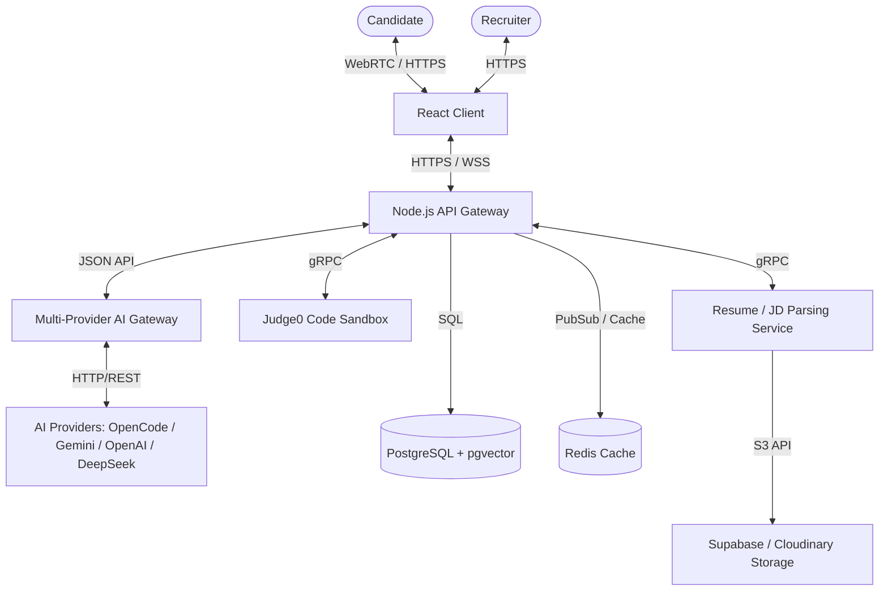
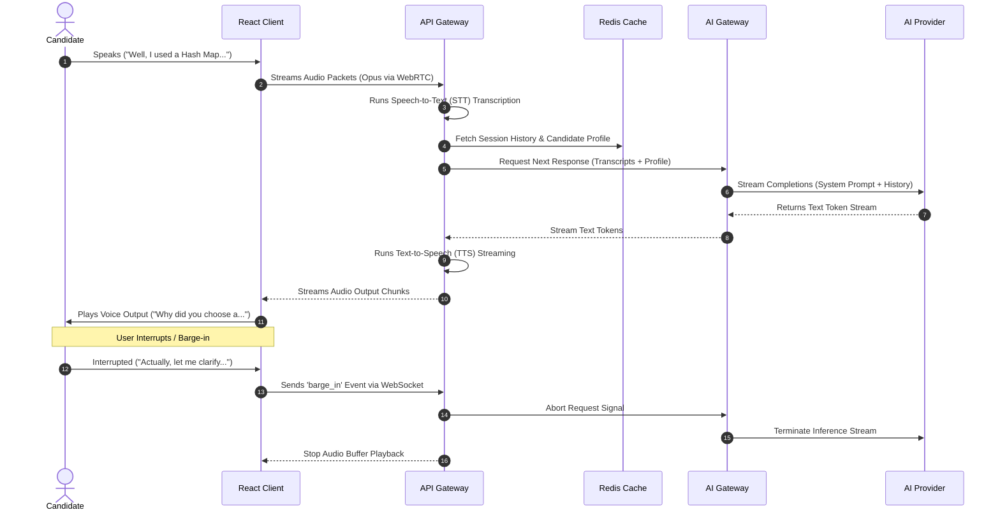

# High-Level Design (HLD): InterviewPilot AI

## 1. Introduction & Objectives
This High-Level Design (HLD) document describes the macro-level architecture of **InterviewPilot AI**. The system coordinates real-time audio interaction, code execution verification, resume intelligence, and conversation memory. The objective is to design a resilient, low-latency, and provider-agnostic platform.

---

## 2. System Context
The following System Context Diagram illustrates how actors and external dependencies interface with the core platform.

### Component Breakdown
*   **React Frontend Application:** Renders the interactive workspace (Monaco Editor, WebRTC audio controller, live feedback visualizer).
*   **Node.js API Gateway:** Manages authentication, session validation, request routing, and coordinates websocket channels.
*   **Resume/JD Parser Service:** Extract structures from PDFs/Word documents, converts them to text, and creates semantic embeddings.
*   **Judge0 Sandbox Service:** Run candidate code in isolated compilers and reports output matches.
*   **Multi-Provider AI Gateway:** Coordinates LLM execution, handles failovers, maintains token counts, and formats output streams.
*   **PostgreSQL Database:** Relational candidate schemas and vector stores.
*   **Redis Cache:** Low-latency storage for user session tokens, prompt fragments, and audio streaming status.

---

## 3. Core System Workflows

### 3.1. Live Voice & Interruption Sequence
The diagram below details the WebRTC/WebSocket connection, transcription, LLM processing, memory retrieval, response synthesis, and user interruption (barge-in).

---

## 4. Subsystem Design Boundaries

| Subsystem | Input Format | Output Format | Protocol |
| :--- | :--- | :--- | :--- |
| **Voice Streaming** | WebRTC Opus Audio Stream | WebSocket JSON events & Raw PCM Audio chunks | WebRTC + WebSocket (Socket.IO) |
| **Parsing Engine** | File Blob (PDF/DOCX) | Structured JSON Skill Schema & Vector Embeddings | gRPC / HTTP POST |
| **AI Gateway** | Unified Prompt Request | Event Stream (Server-Sent Events) | HTTP/2 / REST |
| **Code Runner** | Source Code, Language ID, Test Cases | Execution Status, Stdout, Runtime Time/Memory | REST (HTTPS) |

---

## 5. Architectural Trade-offs & Decisions

### 5.1. Voice Loop: WebSocket vs. WebRTC
*   *Option A (WebSockets):* Send raw PCM audio chunks over binary WebSocket packets.
    *   *Pros:* Extremely simple to implement; works directly with Node.js Socket.IO server.
    *   *Cons:* Lacks jitter buffers and congestion control, leading to audio stuttering over weak mobile networks.
*   *Option B (WebRTC Media Engine):* Implement a full WebRTC peer-to-peer or server-mediated (SFU/MCU) connection.
    *   *Pros:* Low latency, built-in echo cancellation, packet loss concealment, and hardware acceleration.
    *   *Cons:* High server-side CPU resource overhead for audio transcoding and pipeline coordination.
*   *Decision:* **Option B (WebRTC)** for voice transport to guarantee enterprise-grade audio quality, using an SFU architecture for scaling.

### 5.2. Database Design: PostgreSQL (pgvector) vs. Dedicated Vector DB (Pinecone/Milvus)
*   *Option A (Dedicated Vector DB):* Use Pinecone/Milvus.
    *   *Pros:* Highly optimized vector query execution speeds at massive scale (millions of vectors).
    *   *Cons:* Introduces extra network hops, data synchronization complexities, and separate pricing models.
*   *Option B (PostgreSQL with pgvector):* Store relational user profiles and vector embeddings in the same Postgres instance.
    *   *Pros:* Full ACID transactions, single backup strategy, zero data synchronization lag, and easy relational filtering joins.
    *   *Cons:* Requires tuning index structures (HNSW) to prevent high CPU loads during concurrent queries.
*   *Decision:* **Option B (PostgreSQL + pgvector)**. Our vector scale matches candidates and resume files (100k-1M ranges), making the operational simplicity of a unified database the superior engineering choice.
