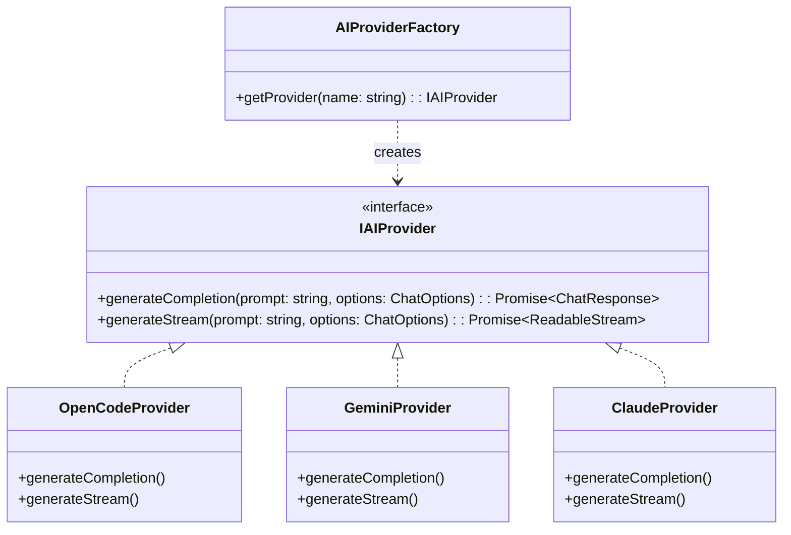
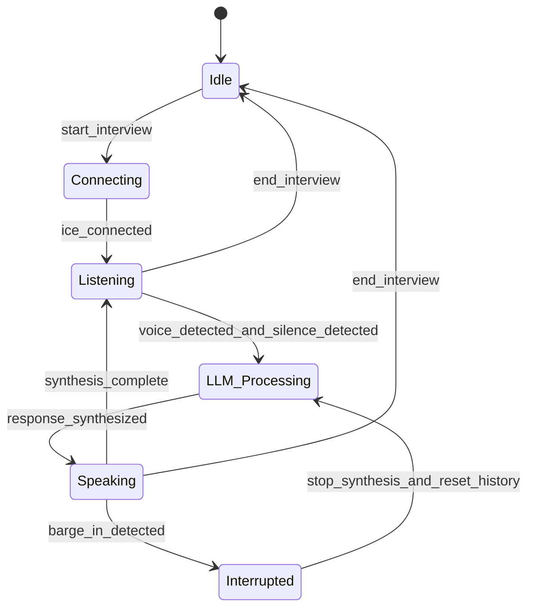

# Low-Level Design (LLD): InterviewPilot AI

## 1. Design Patterns & Interfaces

### 1.1. Factory Pattern for AI Providers
To support interchangeable AI providers without coupling application services, the system implements an `AIProviderFactory` and an `IAIProvider` interface.



#### Code Specification: `IAIProvider.ts`
```typescript
export interface ChatOptions {
  temperature?: number;
  maxTokens?: number;
  topP?: number;
  stopSequences?: string[];
  stream?: boolean;
}

export interface ChatResponse {
  content: string;
  usage: {
    promptTokens: number;
    completionTokens: number;
    totalTokens: number;
  };
  provider: string;
}

export interface IAIProvider {
  generateCompletion(prompt: string, options: ChatOptions): Promise<ChatResponse>;
  generateStream(prompt: string, options: ChatOptions): Promise<ReadableStream<Uint8Array>>;
}
```

---

## 2. Voice Session State Machine
The system manages audio stream states using a formal Finite State Machine (FSM) running in the voice processing worker.



### State Definitions
*   **Idle:** Connection closed, no audio resources allocated.
*   **Connecting:** WebRTC SDP handshake and ICE candidate collection in progress.
*   **Listening:** Candidate is speaking. Input audio is transcribed to text.
*   **LLM_Processing:** Backend is querying the AI Gateway and synthesizing the text token stream to speech.
*   **Speaking:** Backend is streaming synthesized audio chunks back to the candidate.
*   **Interrupted:** VAD detected candidate speaking during synthesized speech playback. Instantly cancels downstream TTS generation.

---

## 3. Data Structures & Domain Models

### 3.1. Interview Session Schema
```typescript
export interface InterviewSession {
  id: string;
  candidateId: string;
  jobDescriptionId: string;
  resumeId: string;
  status: 'SETUP' | 'ACTIVE' | 'COMPLETED' | 'FAILED';
  currentMode: 'BEHAVIORAL' | 'CODING' | 'PROJECT';
  createdAt: Date;
  updatedAt: Date;
}
```

### 3.2. Code Execution Request & Response
```typescript
export interface CodeExecutionRequest {
  sourceCode: string;
  languageId: number; // e.g. Python (71), Javascript (63), Go (60)
  stdin?: string;
  expectedOutput?: string;
}

export interface CodeExecutionResult {
  status: 'ACCEPTED' | 'WRONG_ANSWER' | 'TIME_LIMIT_EXCEEDED' | 'RUNTIME_ERROR' | 'COMPILATION_ERROR';
  stdout: string | null;
  stderr: string | null;
  compileOutputs: string | null;
  timeLimitMs: number;
  memoryUsageKb: number;
}
```

---

## 4. Algorithmic Complexity Analysis

### 4.1. ATS Vector Scoring
*   **Algorithm:** Cosine Similarity between document chunks.
*   **Formula:** 
    $$\text{Similarity}(A, B) = \frac{A \cdot B}{\|A\| \|B\|}$$
*   **Complexity:**
    *   *Insertion:* $O(d \cdot \log N)$ where $d$ is embedding dimensions (e.g. 1536) and $N$ is total chunks in index using HNSW indexes.
    *   *Search:* $O(d \cdot \log N)$ average complexity.

### 4.2. Token Trim Window Optimization
*   **Algorithm:** Dynamic context trimming based on token size threshold.
*   **Process:** Evaluates historical chat messages. When the cumulative token count reaches 80% of the target context window limit, it summarises the oldest 30% of the conversation and appends the summary as a single context block.
*   **Complexity:** $O(M)$ where $M$ is number of messages in session.
