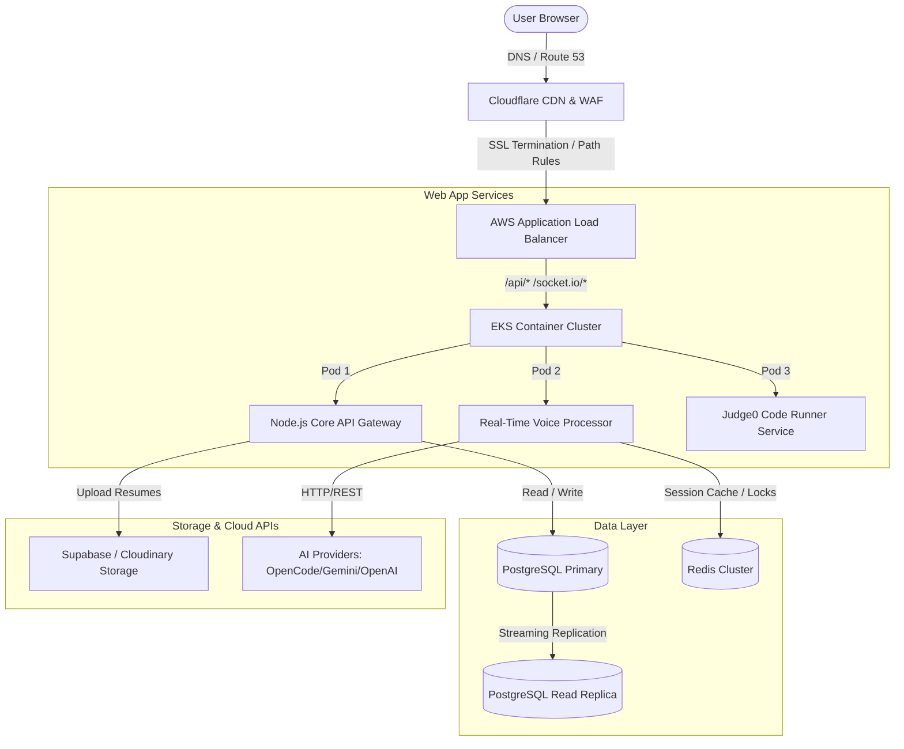
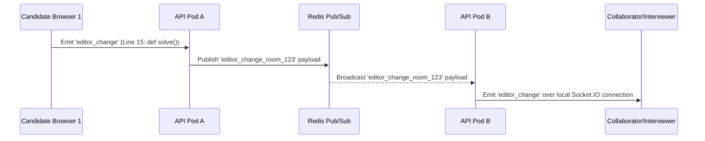

# System Architecture: InterviewPilot AI

## 1. Enterprise Infrastructure Topology
The infrastructure is designed for high availability, minimal packet delay for real-time audio streams, and scalable compute for parser tasks. Deployed multi-region across container platforms (Railway/AWS EKS) and Serverless frameworks (Vercel).

---

## 2. Dynamic Traffic Routing & Jitter Handling

### 2.1. Traffic Management Rules
*   **Static Assets & Dashboard Interface:** Served directly through Cloudflare edge caching, minimizing page loads to <150ms globally.
*   **WebSockets & Voice WebRTC Streams:** Bypasses aggressive caching layers. Route 53 directs candidates to the closest regional cluster (e.g., `us-east-1` vs `eu-west-1`) to minimize WebRTC round-trip latency.
*   **Session Stickiness:** Load balancers enforce cookie-based session stickiness for standard Socket.IO connections, routing client events directly to the container node holding the in-memory context cache.

---

## 3. Real-Time State Synchronization

### 3.1. Redis Pub/Sub for Node Clustering
When scaling backend API pods horizontally, candidate WebSocket connections are distributed across multiple servers. To synchronize editor states, chat logs, and barge-in events across pods, the system uses a **Redis Adapter** for Socket.IO.

---

## 4. Scalability & High Availability Limits

### 4.1. Auto-scaling Policy
*   **Scale-Up Triggers:** 
    *   *Core API pods:* CPU usage > 70% or Memory utilization > 80% for 3 consecutive minutes.
    *   *Voice pods:* Concurrent WebRTC stream count > 150 per pod (enforcing 0.2s reservation headrooms).
*   **Scale-Down Triggers:** CPU utilization < 30% for 15 consecutive minutes, scaling down in increments of 1 pod to prevent flapping.

### 4.2. Database Replication & Vector Query Isolation
To keep heavy semantic similarity and vector queries from degrading write transactions:
*   All data writes (new user accounts, interview completions, score creation) target the **Primary Postgres** node.
*   All read-heavy operations (dashboard histories, vector retrieval, resume similarity searches) target the **Postgres Read Replica** cluster.
*   We enable index-level cache warming for the `HNSW` vector columns in PostgreSQL memory cache (`shared_buffers`) to keep vector query speeds below 30ms.
