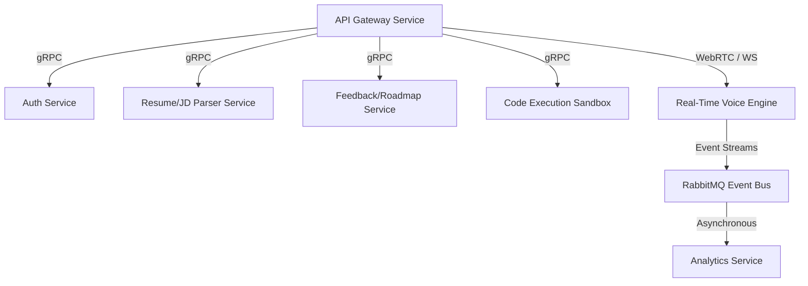
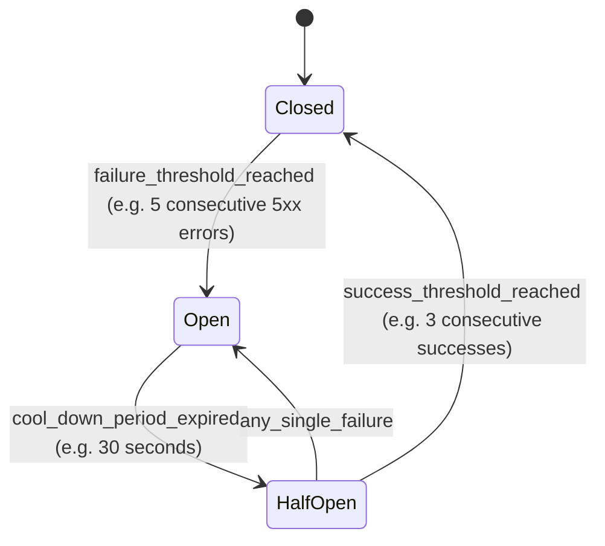

# Microservice Architecture: InterviewPilot AI

## 1. Service Decomposition
The platform is decoupled into specialized microservices to guarantee resource isolation, allow language-specific optimizations (e.g., Python for AI/parsing tasks, TypeScript for low-overhead networking), and prevent single points of failure.



### Microservice Directory & System Boundaries
1.  **Auth Service:** Manages user verification, token generation, profile access, and third-party oauth integrations. (TypeScript/Node.js).
2.  **Resume & JD Parser Service:** Extracts raw text from resumes and crawls job descriptions, converting them into skill vectors. (Python/FastAPI).
3.  **Real-Time Voice Engine:** Coordinates WebRTC streaming, STT processing, AI inference execution, and TTS synthesis. (TypeScript/Node.js).
4.  **Code Execution Sandbox:** Safely evaluates programming submissions inside isolated execution units. (Go/Judge0).
5.  **Feedback & Roadmap Service:** Grades interview transcripts and creates personalized roadmaps. (TypeScript/Node.js).
6.  **Analytics & Notification Service:** Consumes session completion events to build metrics dashboards and send notification emails. (TypeScript/Node.js).

---

## 2. Inter-Service Communication

### 2.1. Synchronous Protocol: gRPC & Protocol Buffers
For internal, high-throughput, low-latency communication, the system uses gRPC over HTTP/2.

#### Example Contract: `parser_service.proto`
```protobuf
syntax = "proto3";

package parser;

service ParserService {
  rpc ParseResume(ParseResumeRequest) returns (ParseResumeResponse);
  rpc CalculateMatchScore(MatchScoreRequest) returns (MatchScoreResponse);
}

message ParseResumeRequest {
  bytes file_content = 1;
  string content_type = 2;
}

message ParseResumeResponse {
  string raw_text = 1;
  repeated string extracted_skills = 2;
  int32 years_experience = 3;
}

message MatchScoreRequest {
  string resume_text = 1;
  string job_description_text = 2;
}

message MatchScoreResponse {
  int32 match_percentage = 1;
  repeated string missing_skills = 2;
  string improvement_plan = 3;
}
```

---

## 3. Fault Tolerance & Resiliency Patterns

### 3.1. Circuit Breakers & Fallback Rules
To prevent cascading failures across microservices, we enforce circuit breakers using libraries like `cockatiel` (Node.js) or `Resilience4j`.



*   **Closed State:** Normal operation. Requests flow straight to downstream services (e.g., Code Execution Sandbox).
*   **Open State:** Downstream service is failing. The gateway short-circuits instantly and returns a cached or degraded response (e.g., "Code sandbox is temporarily compiling code in fallback local checker...").
*   **Half-Open State:** Trials a small fraction of requests to check if the downstream service has recovered.

### 3.2. Rate Limiting & Bulkheads
*   **Bulkhead Pattern:** Restricts the thread pools and connection sockets allocated per microservice client. If the parser service hangs, it will not consume all WebRTC audio server worker sockets, preserving voice platform availability.
*   **Rate Limiter:** Limits incoming user requests to 60 HTTP requests per minute per IP, and voice execution streams to 1 active stream per user session token.
