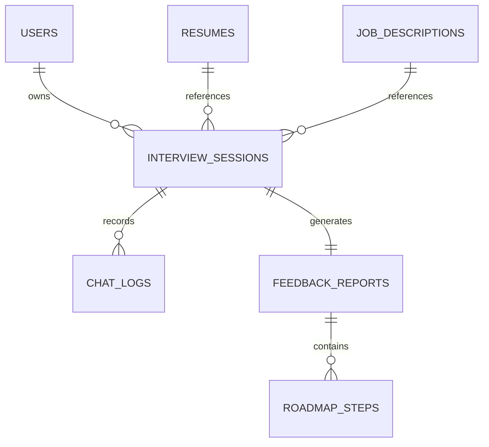

# Database Design: InterviewPilot AI

> ## As-Built (Current Implementation) — updated Phase 6
>
> The app currently persists **one table** — `sessions` — in **Supabase Postgres** (serverless, free tier).
> The JSON-file store (`backend/data/sessions.json`) is retained as the local-dev fallback when
> `DATABASE_URL` is unset. Redis, S3/Supabase Storage, pgvector and the multi-table schema below are
> **not implemented** — they remain forward-looking design.
>
> ### As-built schema (`backend/db/schema.sql`, applied idempotently at boot)
>
> ```sql
> create table if not exists sessions (
>   id             uuid primary key,
>   mode           text not null default 'CODING',
>   role           text not null default 'Software Engineer',
>   company        text not null default 'Unknown',
>   candidate_id   text not null default 'anonymous',
>   resume_text    text not null default '',
>   jd_text        text not null default '',
>   github_summary text not null default '',
>   status         text not null default 'SETUP',
>   created_at     timestamptz not null default now(),
>   started_at     timestamptz,
>   score          integer,
>   duration_ms    bigint,
>   feedback       jsonb,
>   roadmap        jsonb,
>   transcript     jsonb not null default '[]'::jsonb
> );
> ```
>
> - Access layer: `backend/src/services/sessionStore.ts` (pluggable factory) +
>   `stores/postgresStore.ts` + `stores/jsonStore.ts`. In-memory `Map` in
>   `routes/sessions.ts` stays the runtime source of truth; writes are debounced and
>   bulk-upserted (`ON CONFLICT (id) DO UPDATE`).
> - Migration: `npm run db:migrate` moves `backend/data/sessions.json` → Postgres.
> - Original design below (users/resumes/job_descriptions/chat_logs/feedback_reports,
>   pgvector, Redis) is the target for later phases (auth in Phase 10).

---

## 1. Overview & Objectives
The data storage architecture uses a hybrid storage model to optimize transaction safety and semantic query speeds:
1.  **PostgreSQL (Primary Relational Store):** Handles relational records, security configurations, profile details, and contains the `pgvector` extension for semantic indexing.
2.  **Redis (Memory Cache):** Manages websocket session flags, audio lock flags, rate limit logs, and caches AI completion fragments.
3.  **Cloud Storage (S3 / Supabase Storage):** Hosts physical assets like raw candidate resume PDFs and recorded audio session files.

---

## 2. PostgreSQL Relational Schema Design



### Table Definitions

#### 2.1. `users` Table
Stores basic account credentials, authorization roles, and account state parameters.

```sql
CREATE TABLE users (
    id UUID PRIMARY KEY DEFAULT gen_random_uuid(),
    email VARCHAR(255) UNIQUE NOT NULL,
    password_hash VARCHAR(255) NOT NULL,
    first_name VARCHAR(100),
    last_name VARCHAR(100),
    role VARCHAR(50) DEFAULT 'candidate', -- 'candidate', 'recruiter', 'admin'
    created_at TIMESTAMP WITH TIME ZONE DEFAULT CURRENT_TIMESTAMP,
    updated_at TIMESTAMP WITH TIME ZONE DEFAULT CURRENT_TIMESTAMP
);
CREATE INDEX idx_users_email ON users(email);
```

#### 2.2. `resumes` Table
Tracks uploaded resume documents and holds vector representations of experience and skills.

```sql
CREATE TABLE resumes (
    id UUID PRIMARY KEY DEFAULT gen_random_uuid(),
    user_id UUID REFERENCES users(id) ON DELETE CASCADE,
    file_url VARCHAR(512) NOT NULL,
    parsed_text TEXT,
    skills TEXT[],
    experience_vector vector(1536), -- 1536-dimensional embeddings (e.g. OpenAI text-embedding-3-small)
    created_at TIMESTAMP WITH TIME ZONE DEFAULT CURRENT_TIMESTAMP
);
CREATE INDEX idx_resumes_user_id ON resumes(user_id);
```

#### 2.3. `job_descriptions` Table
Tracks target job descriptions for context matching.

```sql
CREATE TABLE job_descriptions (
    id UUID PRIMARY KEY DEFAULT gen_random_uuid(),
    title VARCHAR(255) NOT NULL,
    company VARCHAR(255),
    raw_text TEXT NOT NULL,
    skills_required TEXT[],
    jd_vector vector(1536),
    created_at TIMESTAMP WITH TIME ZONE DEFAULT CURRENT_TIMESTAMP
);
```

#### 2.4. `interview_sessions` Table
Coordinates active and completed interview workflows.

```sql
CREATE TABLE interview_sessions (
    id UUID PRIMARY KEY DEFAULT gen_random_uuid(),
    user_id UUID REFERENCES users(id) ON DELETE CASCADE,
    resume_id UUID REFERENCES resumes(id),
    job_description_id UUID REFERENCES job_descriptions(id),
    status VARCHAR(50) DEFAULT 'SETUP', -- 'SETUP', 'ACTIVE', 'COMPLETED', 'FAILED'
    current_mode VARCHAR(50) DEFAULT 'BEHAVIORAL', -- 'BEHAVIORAL', 'CODING', 'PROJECT'
    created_at TIMESTAMP WITH TIME ZONE DEFAULT CURRENT_TIMESTAMP,
    updated_at TIMESTAMP WITH TIME ZONE DEFAULT CURRENT_TIMESTAMP
);
```

#### 2.5. `chat_logs` Table
Maintains historical turn-by-turn records for memory injection.

```sql
CREATE TABLE chat_logs (
    id UUID PRIMARY KEY DEFAULT gen_random_uuid(),
    session_id UUID REFERENCES interview_sessions(id) ON DELETE CASCADE,
    sender VARCHAR(50) NOT NULL, -- 'system', 'interviewer', 'candidate'
    message_text TEXT NOT NULL,
    audio_url VARCHAR(512),
    message_vector vector(1536), -- For long-term memory retrieval
    created_at TIMESTAMP WITH TIME ZONE DEFAULT CURRENT_TIMESTAMP
);
CREATE INDEX idx_chat_logs_session_id ON chat_logs(session_id);
```

#### 2.6. `feedback_reports` Table
Stores overall evaluations generated at completion.

```sql
CREATE TABLE feedback_reports (
    id UUID PRIMARY KEY DEFAULT gen_random_uuid(),
    session_id UUID UNIQUE REFERENCES interview_sessions(id) ON DELETE CASCADE,
    score_technical INT NOT NULL,
    score_communication INT NOT NULL,
    score_behavioral INT NOT NULL,
    summary_evaluation TEXT NOT NULL,
    created_at TIMESTAMP WITH TIME ZONE DEFAULT CURRENT_TIMESTAMP
);
```

---

## 3. pgvector Index Configuration
To perform sub-30ms semantic search lookups across millions of message vectors and resumes, we implement a **Hierarchical Navigable Small World (HNSW)** index.

```sql
-- Enable pgvector extension
CREATE EXTENSION IF NOT EXISTS vector;

-- Create HNSW index for cosine distance calculation on chat logs
CREATE INDEX idx_chat_logs_vector_hnsw ON chat_logs 
USING hnsw (message_vector vector_cosine_ops)
WITH (m = 16, ef_construction = 64);

-- Create HNSW index for cosine distance calculation on resumes
CREATE INDEX idx_resumes_vector_hnsw ON resumes 
USING hnsw (experience_vector vector_cosine_ops)
WITH (m = 16, ef_construction = 64);
```

---

## 4. Redis Keyspace Layout & Caching Strategy

| Key Pattern | Data Type | TTL (Time-To-Live) | Purpose |
| :--- | :--- | :--- | :--- |
| `session:{session_id}:tokens` | Hash | 15 minutes | Active user authentication tokens and roles. |
| `interview:{session_id}:state` | String (JSON) | 2 hours | Current state variables (VAD flags, current editor content). |
| `rate:{ip_address}` | String (Counter) | 1 minute | Rate limiting tracker. |
| `audio:lock:{session_id}` | String | 5 seconds | Distributed lock ensuring sequence matching during streaming. |
