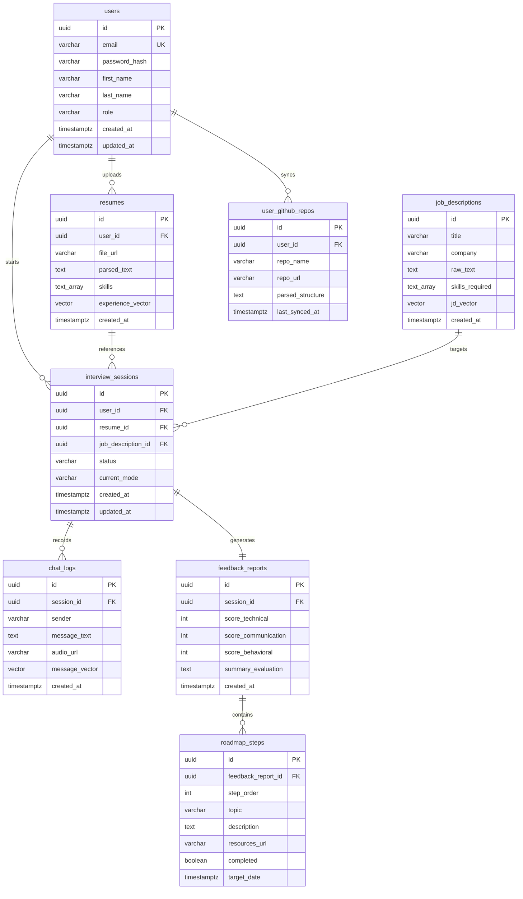

# Entity-Relationship (ER) Diagram & Schema Dictionary

## 1. Relational ER Diagram (Mermaid)
The following physical ER diagram shows all system tables, data types, keys, indices, and constraints.

---

## 2. Relational Schema Data Dictionary

### 2.1. `users` Table
| Column Name | Data Type | Nullable | Keys | Constraints | Description |
| :--- | :--- | :--- | :--- | :--- | :--- |
| `id` | `uuid` | NO | PK | DEFAULT gen_random_uuid() | Unique identifier for each system user. |
| `email` | `varchar(255)` | NO | UK | UNIQUE | User login email. |
| `password_hash` | `varchar(255)` | NO | - | - | Salted and hashed password. |
| `first_name` | `varchar(100)` | YES | - | - | User first name. |
| `last_name` | `varchar(100)` | YES | - | - | User last name. |
| `role` | `varchar(50)` | NO | - | DEFAULT 'candidate' | Security role (`candidate`, `recruiter`, `admin`). |
| `created_at` | `timestamptz` | NO | - | DEFAULT NOW() | Record creation timestamp. |
| `updated_at` | `timestamptz` | NO | - | DEFAULT NOW() | Record update timestamp. |

### 2.2. `chat_logs` Table
| Column Name | Data Type | Nullable | Keys | Constraints | Description |
| :--- | :--- | :--- | :--- | :--- | :--- |
| `id` | `uuid` | NO | PK | DEFAULT gen_random_uuid() | Unique identifier for the turn message. |
| `session_id` | `uuid` | NO | FK | REFERENCES interview_sessions(id) ON DELETE CASCADE | Associated interview session. |
| `sender` | `varchar(50)` | NO | - | CHECK (`sender` IN ('system', 'interviewer', 'candidate')) | Speaker role. |
| `message_text` | `text` | NO | - | - | Transcribed or generated chat text. |
| `audio_url` | `varchar(512)` | YES | - | - | S3 storage location of corresponding speech audio. |
| `message_vector`| `vector(1536)`| YES | - | - | Semantic vector embedding for RAG memory search. |
| `created_at` | `timestamptz` | NO | - | DEFAULT NOW() | Timestamp of speech. |

---

## 3. Database Indexes & Query Constraints
*   `users_pkey`: B-Tree index on `users.id` (Automatic).
*   `idx_users_email`: B-Tree index on `users.email` (For authentication lookup).
*   `idx_chat_logs_session_created`: Composite B-Tree index on `chat_logs(session_id, created_at ASC)` to pull ordered conversation transcript histories.
*   `idx_chat_logs_vector_hnsw`: pgvector HNSW index using Cosine operators for real-time memory RAG execution.
