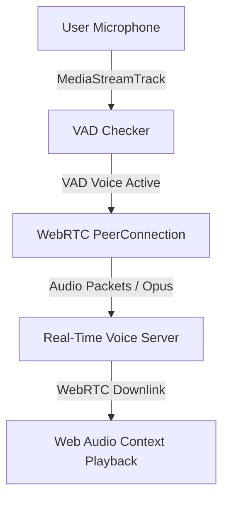

# Frontend Architecture: React, Vite & TypeScript

## 1. Directory Structure
The frontend application follows a feature-based structure to ensure scalability, ease of test isolation, and separation of concerns.

```text
frontend/
├── public/
├── src/
│   ├── assets/             # Global graphics, icons, and SVG sprites
│   ├── components/         # Reusable design system UI elements (buttons, inputs)
│   ├── config/             # Environment configurations and constants
│   ├── features/           # Feature-specific modules (auth, interview, dashboard)
│   │   ├── interview/
│   │   │   ├── components/ # VoiceWidget, CodeWorkspace, TranscriptPanel
│   │   │   ├── hooks/      # useWebRTC, useVAD, useMonaco
│   │   │   ├── services/   # socketService, audioStreamer
│   │   │   └── store/      # interviewStore.ts
│   │   └── dashboard/
│   ├── hooks/              # Global custom hooks (useAuth, useTheme)
│   ├── layouts/            # Page shell layouts (DashboardLayout, WorkspaceLayout)
│   ├── lib/                # External library wrappers (shadcn setup, queryClient)
│   ├── routes/             # Client-side routing maps (React Router v6)
│   ├── styles/             # Global CSS variables and tailwind tokens
│   ├── types/              # Domain typescript definitions
│   ├── App.tsx             # Application core component
│   └── main.tsx            # Application entry mounting script
```

---

## 2. State Management Design (Zustand & React Query)

### 2.1. Zustand Interview State Store
We use Zustand for synchronous, volatile UI state (e.g., audio playing statuses, toggle parameters, code editor values) due to its light weight and lack of boilerplate.

#### Code Implementation: `interviewStore.ts`
```typescript
import { create } from 'zustand';

interface InterviewState {
  isRecording: boolean;
  isPlayingAudio: boolean;
  currentCode: string;
  editorLanguage: string;
  transcript: Array<{ sender: string; text: string }>;
  startVoice: () => void;
  stopVoice: () => void;
  setPlayingAudio: (status: boolean) => void;
  updateCode: (newCode: string) => void;
  addTranscript: (sender: string, text: string) => void;
}

export const useInterviewStore = create<InterviewState>((set) => ({
  isRecording: false,
  isPlayingAudio: false,
  currentCode: '',
  editorLanguage: 'python',
  transcript: [],
  startVoice: () => set({ isRecording: true }),
  stopVoice: () => set({ isRecording: false }),
  setPlayingAudio: (status) => set({ isPlayingAudio: status }),
  updateCode: (newCode) => set({ currentCode: newCode }),
  addTranscript: (sender, text) =>
    set((state) => ({ transcript: [...state.transcript, { sender, text }] })),
}));
```

### 2.2. React Query for Server Data Cache
React Query handles server-state caching (resumes, past interview records, dashboard stats). It manages automatic retries, cache invalidation after session creation, and optimistic UI rendering.

---

## 3. WebRTC Audio Engine & Voice Activity Detection (VAD)

### 3.1. Audio Capture & WebRTC Loop
Low-latency speech delivery relies on WebRTC peer connection channels using an audio-only schema configuration.



### 3.2. VAD & Interruption Handler
We use a lightweight WebAssembly wrapper of Silero VAD (or an AudioWorkletProcessor node) directly inside the user's browser.
*   **Acoustic Settings:** Standard 16kHz sampling rate, single mono-channel input capture.
*   **VAD Logic:** Evaluates 30ms window buffers. If voice activity probability exceeds 85% for more than 5 consecutive frames while audio playback from the server is active, a `barge_in` event triggers.
*   `useVAD.ts` immediately runs `AudioContext.suspend()` to mute output speakers instantly and emits the interruption packet via Socket.IO to tell the backend to halt LLM processing.
