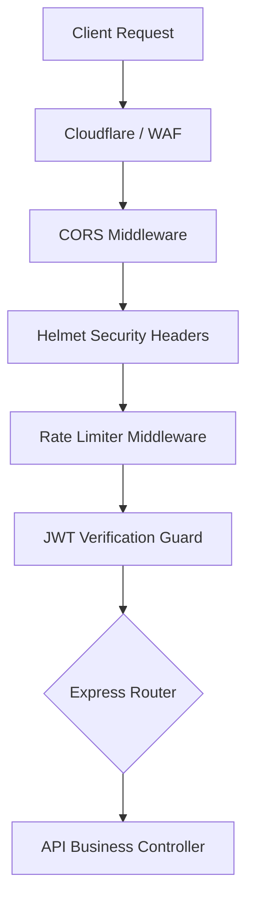
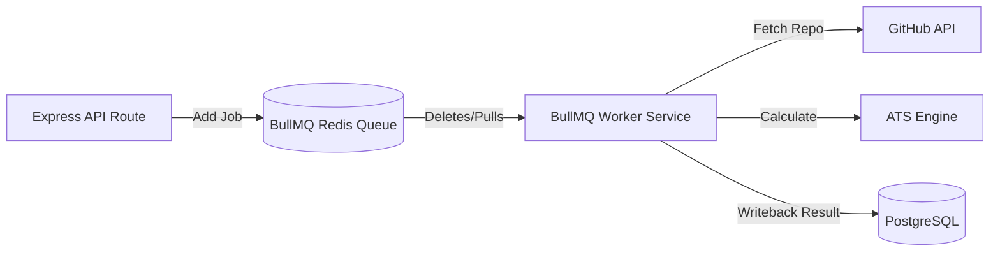

# Backend Architecture: Node.js, Express & WebSockets

## 1. Directory Structure
The backend codebase follows a clean-layered structure to isolate routers, database models, business logic controllers, and external gateway services.

```text
backend/
├── src/
│   ├── api/                # REST endpoints and controllers
│   │   ├── controllers/    # Route controllers (auth, session, resume)
│   │   ├── middlewares/    # Custom middlewares (authGuard, rateLimiter, validator)
│   │   └── routes/         # Express router maps
│   ├── config/             # DB, Redis, and AI credential configurations
│   ├── core/               # App configuration, server bootstrap, socket wrappers
│   ├── database/           # PostgreSQL entities and migration scripts
│   ├── jobs/               # Background task queues (BullMQ workers)
│   ├── services/           # Business logic layers (VoiceService, MemoryEngine)
│   ├── types/              # TS interface definitions
│   ├── utils/              # Common helper functions (logger, hash, validation)
│   └── app.ts              # Express application configuration
│   └── server.ts           # Server runner and WebSocket listener mount
├── Dockerfile              # Production container build
└── package.json
```

---

## 2. Server Setup & Middleware Pipeline
The Node.js server bootstraps an Express framework listener combined with a Socket.IO WebSocket server attached to the same HTTP server socket.



### 2.1. Middleware Execution Stack
*   **Helmet:** Injects security headers (CSP, X-Frame-Options, STS headers) to protect against common web vulnerabilities.
*   **CORS:** Restricts requests to allowed origins, checking authentication cookies in request metadata.
*   **Rate Limiter:** Employs `express-rate-limit` using a Redis backend to block IP-based API spam attacks.
*   **Auth Guard:** Extracts JWT Bearer credentials from request headers, decrypts the token signature using the asymmetric public key, and inserts user attributes (`req.user`) into the active request context.

---

## 3. Background Task Runner (BullMQ)
Tasks requiring significant compute or external network access—such as parsing large resume PDFs, scanning GitHub files, or running ATS comparison loops—must run out-of-band to prevent blocking Node's main single-threaded event loop.



### BullMQ Configuration: `queue.ts`
```typescript
import { Queue, Worker, Job } from 'bullmq';
import IORedis from 'ioredis';

const connection = new IORedis(process.env.REDIS_URL || 'redis://localhost:6379');

// Queue instance to add background tasks
export const resumeParsingQueue = new Queue('resume-parsing', { connection });

// Background worker to consume queues
const worker = new Worker(
  'resume-parsing',
  async (job: Job) => {
    const { fileUrl, userId } = job.data;
    console.log(`Processing resume parsing job ${job.id} for user ${userId}`);
    
    // Core heavy work goes here:
    // 1. Download file content from Storage.
    // 2. Extract Text via PDF parsing script.
    // 3. Compute vector representations.
    // 4. Save results to PostgreSQL profiles.
  },
  { connection, concurrency: 5 } // Limits maximum active concurrent jobs per worker thread
);
```
