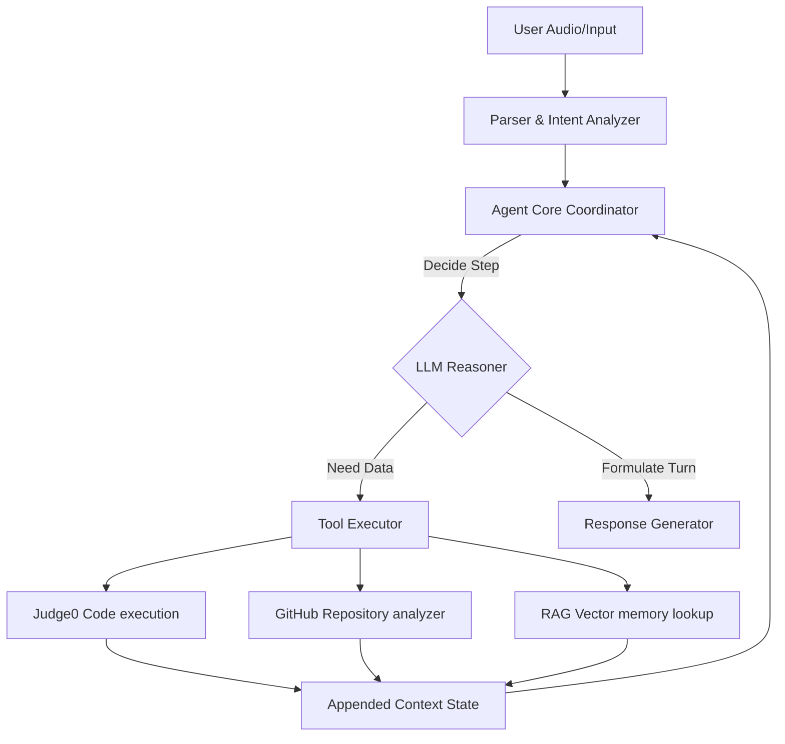

# AI Agent Architecture: Agent Loops & Decision Pipelines

> ## As-Built (Current Implementation)
>
> The interviewer is `backend/src/services/interviewEngine.ts` (+ `handlers/interviewHandler.ts`
> on the `/interview` Socket.IO namespace). It runs a mode-based turn loop
> (behavioral → coding → project) with explicit stage prompts, evaluates via a prompt
> chain, and stores progress in-memory per session (survives restarts via the session store).
> AI completions come through the gateway in `backend/src/services/aiGateway.ts`.
>
> - **No Judge0 sandbox** is wired in the current build (coding-mode answers are evaluated
>   by the LLM + rules, not executed).
> - **No RAG/vector memory** — context is the session transcript (kept in memory and
>   replayed to stateless providers).
> - Tool-executor contracts (`agent_tools.ts`), persona tables and the guardrails below
>   describe the intended design; turn caps and graceful-degrade behavior are implemented
>   in `interviewEngine.ts`.

---

## 1. Agent Agentic Conceptual System
The interviewer operates as an active conversational agent rather than a passive chatbot. It uses a **ReAct (Reason + Action)** execution loop, enabling it to determine when to query external data (e.g., repository contents or coding solutions) or ask follow-up questions to assess candidate competence.



---

## 2. ReAct Decision Execution Loop
At each turn of the conversation, the agent coordinator runs a loop checking candidate inputs, context states, and session history before choosing an action.

```text
Step 1: RECEIVE candidate transcript ("I would write a recursive function to find files...")
Step 2: RETRIEVE historical session memory (e.g., candidate prefers functional programming, struggled with recursion earlier)
Step 3: THINK (Determine if current statement has a bug, or is code optimization needed)
Step 4: CHOOSE ACTION (Run code in Sandbox, search repo file structure, or generate verbal follow-up query)
Step 5: EXECUTE (Run tool and get output observation)
Step 6: SYNTHESIZE (Generate conversational prompt response incorporating observation)
```

---

## 3. Tool Interface Definitions & Code Contracts
The agent coordinator interacts with tools through a unified execution interface.

### Tool Types & Code Schema: `agent_tools.ts`
```typescript
export interface ToolContext {
  sessionId: string;
  userId: string;
}

export interface ToolDefinition {
  name: string;
  description: string;
  parameters: {
    type: 'object';
    properties: Record<string, any>;
    required: string[];
  };
}

export abstract class BaseAgentTool {
  abstract definition: ToolDefinition;
  abstract execute(args: Record<string, any>, context: ToolContext): Promise<any>;
}

// Example: Sandbox Code Runner Tool
export class CodeSandboxTool extends BaseAgentTool {
  definition = {
    name: 'run_sandboxed_code',
    description: 'Executes candidate code inside a secure environment to check test cases.',
    parameters: {
      type: 'object' as const,
      properties: {
        code: { type: 'string', description: 'Source code content' },
        languageId: { type: 'number', description: 'Judge0 programming language token identifier' }
      },
      required: ['code', 'languageId']
    }
  };

  async execute(args: { code: string; languageId: number }, context: ToolContext): Promise<any> {
    // Execution calls Judge0 service internally
  }
}
```

---

## 4. Agent Personas & Operational Contexts
The agent adjusts its conversational prompt wrappers dynamically based on the current interview step:

| Persona Role | Style | Primary Objective | Key Evaluation Targets |
| :--- | :--- | :--- | :--- |
| **System Architect** | Academic, analytical, deep-diving | Evaluate scalability understanding and trade-offs | Microservices, load balancers, consistency vs availability |
| **Coding Coach** | Technical, brief, hint-driven | Evaluate algorithmic competency | Time complexity, edge cases, clear code conventions |
| **HR Screener** | Warm, structured, STAR-oriented | Evaluate communication, leadership, conflict resolution | STAR story formats, team collaboration, motivation |

---

## 5. Failure Recoveries & Hallucination Guardrails
To prevent looping, incorrect comments on correct code, or processing failures:
1.  **Hallucination Checkers:** When commenting on code errors, the agent first executes the code via Judge0. The stdout results override the LLM's assertions, preventing false-positive error flags.
2.  **Turn Cap Guards:** If the conversational turn count in any single mode (e.g., Coding Mode) exceeds 8 turns, the coordinator overrides LLM decisions and prompts the user to move to the next stage ("Alright, let's wrap up this code challenge and proceed to...").
3.  **Graceful Degrade:** If the STT audio is garbled or network drops cause package loss, the agent prompts: "I didn't quite catch that. Could you repeat your last point?" rather than guessing.
