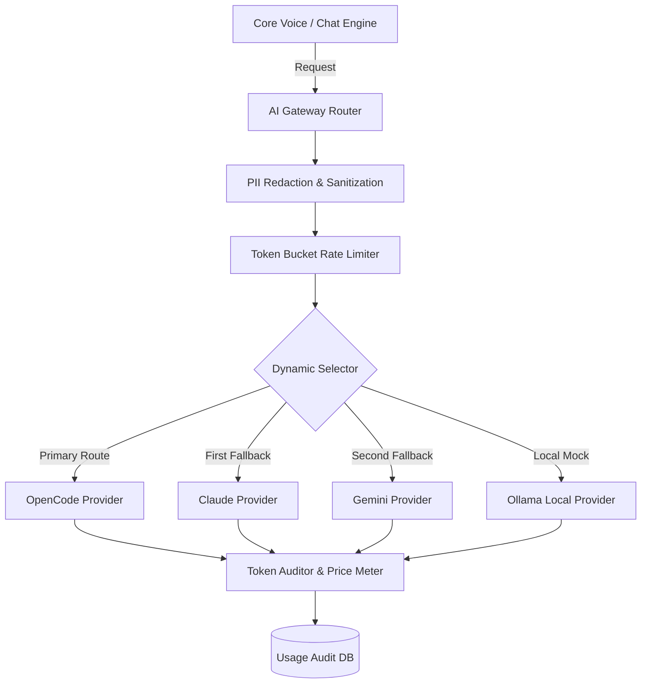
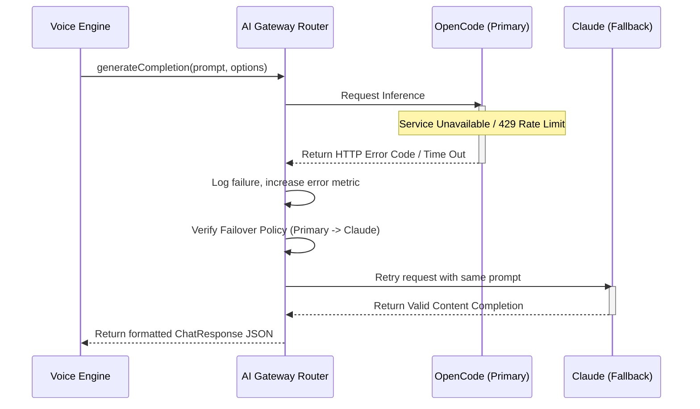

# AI Gateway Architecture: Multi-Provider Routing & Load Balancing

> ## As-Built (Current Implementation) — updated Phase 3–5
>
> The gateway is `backend/src/services/aiGateway.ts` (a thin facade) over the
> **ProviderRouter** (`backend/src/services/providerRouter.ts`), which orders provider
> adapters by `AI_PROVIDER_ORDER` (default `omniroute,opencode`) and fails over with
> full-history replay. Costs are $0 — no paid API keys.
>
> - **Primary — OmniRoute** (`providers/openaiCompatProvider.ts`): free self-hosted
>   multi-provider proxy on `http://127.0.0.1:20128`, stateless OpenAI-compatible
>   `POST /v1/chat/completions` with `model: auto` (quota-aware free routing).
>   Health-checked via `GET /v1/models`. Use `127.0.0.1` — OmniRoute binds IPv4 only.
> - **Fallback — opencode** (`providers/opencodeProvider.ts`): native session API at
>   `http://127.0.0.1:4096`, basic auth, server-side context.
> - **Last resort — deterministic mock** (`fromMock: true`): interview keeps running
>   without any provider.
> - Retry: `AI_GATEWAY_MAX_RETRIES` (default 1) per provider with exponential backoff +
>   jitter, then cross-provider failover. `createGatewaySession` probes providers at
>   session start; `gatewayStatus()` reports the primary.
> - The usage-audit table, token bucket rate limiter and per-provider metering below are
>   **not implemented** — design targets only.

---

## 1. Gateway Overview & System Layout
The **AI Gateway** serves as a resilient interface decoupling InterviewPilot AI core services from individual LLM providers. By providing standard prompt/response templates, it enables runtime selection of models based on current pricing, latency, and service availability.



---

## 2. Dynamic Provider Routing & Failover Sequence
The gateway handles failures gracefully, automatically trying other providers to keep interviews running smoothly.



### Failover Policy Config Structure
```typescript
interface ProviderConfig {
  providerName: string;
  modelName: string;
  timeoutMs: number;
  maxRetries: number;
}

export const failoverRoutes: Record<string, ProviderConfig[]> = {
  default: [
    { providerName: 'OpenCode', modelName: 'opencode-v2-70b', timeoutMs: 2500, maxRetries: 2 },
    { providerName: 'Claude', modelName: 'claude-3-5-sonnet', timeoutMs: 3000, maxRetries: 1 },
    { providerName: 'Gemini', modelName: 'gemini-1.5-pro', timeoutMs: 3000, maxRetries: 1 }
  ],
  coding: [
    { providerName: 'OpenCode', modelName: 'opencode-v2-coder', timeoutMs: 2000, maxRetries: 2 },
    { providerName: 'DeepSeek', modelName: 'deepseek-coder-v2', timeoutMs: 2500, maxRetries: 1 }
  ]
};
```

---

## 3. Cost Metering & Token Auditing Engine
To prevent financial exhaustion and audit enterprise SaaS usage, the gateway logs pricing metadata for every LLM transaction.

*   **Prompt Token Tracker:** Measures characters and estimates token length before dispatching requests.
*   **Response Token Audit:** Retrieves exact tokens returned by LLM usage metadata headers.
*   **Cost Calculation:** Multiplies prompt and completion token counts by the provider's active price-per-million rates.

### Audit Relational Entity
```sql
CREATE TABLE ai_gateway_audits (
    id UUID PRIMARY KEY DEFAULT gen_random_uuid(),
    session_id UUID REFERENCES interview_sessions(id) ON DELETE SET NULL,
    provider_name VARCHAR(100) NOT NULL,
    model_name VARCHAR(100) NOT NULL,
    prompt_tokens INT NOT NULL,
    completion_tokens INT NOT NULL,
    total_cost NUMERIC(10, 6) NOT NULL, -- USD cost with high decimal precision
    latency_ms INT NOT NULL,
    status_code INT NOT NULL,
    created_at TIMESTAMP WITH TIME ZONE DEFAULT CURRENT_TIMESTAMP
);
```

---

## 4. Retries & Rate Limiting Strategy
*   **Exponential Backoff:** If a request fails due to temporary network issues, the gateway retries after a short delay that doubles with each attempt.
    *   Formula: $T_{\text{delay}} = T_{\text{initial}} \times 2^{\text{attempt}}$ (e.g., 200ms, 400ms, 800ms) with random jitter to prevent thundering herd problems.
*   **Token Bucket Rate Limiter:** Limits outbound requests using Redis to prevent exceeding API provider rate limits.
