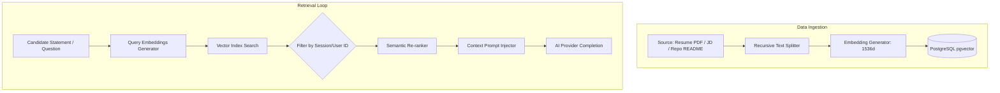

# Retrieval-Augmented Generation (RAG) Architecture

## 1. Context Injection Pipeline
To ensure the AI interviewer asks relevant, fact-based questions grounded in the candidate's actual background and the target role, the system uses a **Retrieval-Augmented Generation (RAG)** pipeline.



---

## 2. Document Chunking & Ingestion Strategy
To maintain precise retrieval without losing context:
*   **Resume Documents:** Chunked using a *Recursive Character Text Splitter*.
    *   *Chunk Size:* 512 characters.
    *   *Overlap:* 64 characters (keeps context from splitting across sections).
*   **Job Descriptions:** Chunked by structural section headers (e.g., "Responsibilities", "Qualifications") using a Markdown Header Splitter.
*   **GitHub Repositories:** Individual files are processed based on class and function definitions using AST parsing (slated for Project Analyzer), rather than arbitrary line counts.

### Ingestion Metadata Schema
Every vector stored in the PostgreSQL database includes metadata tags to scope queries and speed up index lookups:
```json
{
  "userId": "uuid-value",
  "sessionId": "uuid-value",
  "documentType": "resume | job_description | git_file",
  "sourceFile": "filename.pdf",
  "timestamp": 1783921820
}
```

---

## 3. Retrieval & Semantic Re-ranking
1.  **Vector Search:** Performs a cosine similarity search on the vector column, matching the user's latest query against the database index.
2.  **Metadata Join Filtering:** Restricts searches to vectors matching the active user's `userId` and `sessionId` to prevent cross-tenant data leaks.
3.  **Semantic Re-ranking (Cross-Encoder):** Filters the top 10 vector results through a lightweight re-ranking model (e.g., `bge-reranker-base`) to identify the top 3 most relevant context blocks.
4.  **Prompt Assembly:** Inject the top 3 context blocks into the LLM prompt inside a clean container tag:
    ```text
    Use the following verified context to guide your response. Do not assume facts outside this context:
    <verified_context>
    - [Context 1]
    - [Context 2]
    </verified_context>
    ```

---

## 4. Context Window & Token Management
*   **Context Budgets:**
    *   *System Persona:* 1,500 tokens.
    *   *RAG Context:* 1,000 tokens.
    *   *Short-term Chat History:* 2,500 tokens.
    *   *Token Buffer Room:* 1,000 tokens.
    *   *Total Context Budget:* 6,000 tokens (fits well within modern 8k-128k LLM limits).
*   **Dynamic Trimming:** If the chat history exceeds 2,500 tokens, the oldest turns are summarized using a helper model, reducing their token usage while preserving conversation continuity.
