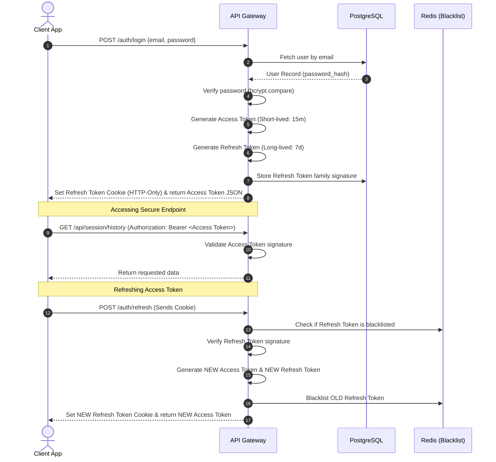

# Authentication Design: JWT & Refresh Token Rotation

## 1. Authentication Flow
The system uses stateless JSON Web Tokens (JWT) for session management, paired with a secure **Refresh Token Rotation (RTR)** mechanism to minimize the risk of token theft.



---

## 2. Token Specifications & Payloads

### 2.1. Access Token Payload (JWT)
*   **Signature Algorithm:** RS256 (asymmetric cryptography using public/private key pairs).
*   **Lifetime:** 15 minutes.
*   **Payload Schema:**
```json
{
  "iss": "interviewpilot.ai",
  "sub": "usr_7ba39d12-120d-4fa4-a212-36c12b322a11",
  "role": "candidate",
  "email": "candidate.clara@example.com",
  "iat": 1783921800,
  "exp": 1783922700
}
```

### 2.2. Refresh Token Payload (JWT)
*   **Signature Algorithm:** HS256 (symmetric cryptography using shared secrets).
*   **Lifetime:** 7 days.
*   **Payload Schema:**
```json
{
  "iss": "interviewpilot.ai",
  "sub": "usr_7ba39d12-120d-4fa4-a212-36c12b322a11",
  "tokenId": "rtk_9b329a12-88d0-4ba4-9a00-11112b322a00",
  "familyId": "fam_22229a12-11d0-4ba4-9a00-33332b322aaa",
  "exp": 1784526600
}
```

---

## 3. Storage & Security Policies

### 3.1. Cookie Configuration
To protect against Cross-Site Scripting (XSS) attacks, refresh tokens are stored exclusively in HTTP-only cookies.
```http
Set-Cookie: refreshToken=eyJhbGciOiJIUzI1NiIsInR5cCI6IkpXVCJ9...; 
            Secure; 
            HttpOnly; 
            SameSite=Strict; 
            Path=/v1/auth; 
            Max-Age=604800;
```

### 3.2. Security Measures
*   **Refresh Token Rotation (RTR):** Every token refresh invalidates the used refresh token and issues a new one. If the backend receives an invalidated refresh token, it assumes token theft has occurred, invalidates the entire token family, and forces the user to log in again.
*   **Password Hashing:** Passwords are encrypted before storage using **bcrypt** with a cost factor of `12` to protect against brute-force attacks.
*   **CSRF Prevention:** Double-Submit Cookie patterns protect the REST API from Cross-Site Request Forgery, and WebSocket connections verify the origin header on handshake.
*   **XSS Protection:** Output sanitization (using `dompurify` client-side) prevents malicious scripts from running in transcript panels or code editors.
