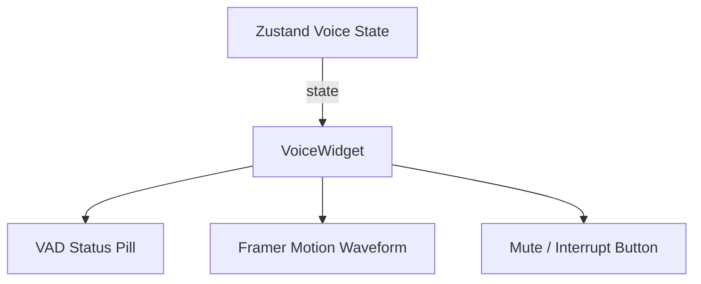

# Component Library: Reusable shadcn/ui Definitions

## 1. UI Components Specifications

### 1.1. VoiceWidget Component
Renders the voice connection state, displays real-time audio waveform animations, and shows status updates from the Voice Activity Detection (VAD) engine.



#### TypeScript Specification: `VoiceWidget.tsx`
```typescript
import React from 'react';
import { useInterviewStore } from '@/features/interview/store/interviewStore';
import { Button } from '@/components/ui/button';
import { cn } from '@/lib/utils';

export interface VoiceWidgetProps {
  sessionId: string;
  onBargeIn: () => void;
  className?: string;
}

export const VoiceWidget: React.FC<VoiceWidgetProps> = ({ sessionId, onBargeIn, className }) => {
  const { isRecording, isPlayingAudio, startVoice, stopVoice } = useInterviewStore();

  return (
    <div className={cn("p-6 rounded-2xl bg-slate-900 border border-slate-800 shadow-xl", className)}>
      <div className="flex flex-col items-center justify-center space-y-4">
        {/* Dynamic VAD Status Indicator */}
        <div className="flex items-center space-x-2">
          <span className={cn(
            "h-3 w-3 rounded-full animate-pulse",
            isRecording ? "bg-emerald-500" : "bg-rose-500"
          )} />
          <span className="text-sm font-medium text-slate-300">
            {isRecording ? "AI Listening" : "Muted"}
          </span>
        </div>

        {/* Dynamic Waveform Visualizer */}
        <div className="h-20 w-full flex items-center justify-center space-x-1">
          {isRecording && isPlayingAudio ? (
            Array.from({ length: 12 }).map((_, i) => (
              <span 
                key={i} 
                className="w-1 bg-cyan-400 rounded-full animate-bounce"
                style={{ animationDelay: `${i * 0.05}s`, height: `${Math.random() * 80 + 20}%` }}
              />
            ))
          ) : (
            <span className="text-slate-500 text-xs font-mono">Audio Stream Inactive</span>
          )}
        </div>

        {/* Audio Control Actions */}
        <div className="flex space-x-3 w-full">
          <Button
            variant={isRecording ? "destructive" : "default"}
            className="w-full font-bold"
            onClick={isRecording ? stopVoice : startVoice}
          >
            {isRecording ? "Disconnect Voice" : "Connect Voice"}
          </Button>
          {isPlayingAudio && (
            <Button variant="outline" className="font-bold border-rose-500 text-rose-500" onClick={onBargeIn}>
              Interrupt AI
            </Button>
          )}
        </div>
      </div>
    </div>
  );
};
```

---

## 2. Integrated Code Workspace Component
Displays the mock interview coding workspace, syncing Monaco Editor changes and executing test suites via the backend.

### 2.1. Component Code Contract: `CodeWorkspace.tsx`
```typescript
import React, { useState } from 'react';
import MonacoEditor from '@monaco-editor/react';
import { Button } from '@/components/ui/button';

interface TestSuiteOutput {
  passed: number;
  total: number;
  stdout: string | null;
  stderr: string | null;
}

export const CodeWorkspace: React.FC = () => {
  const [code, setCode] = useState<string>('# Write your recursive algorithm here');
  const [testResult, setTestResult] = useState<TestSuiteOutput | null>(null);
  const [isRunning, setIsRunning] = useState(false);

  const triggerCodeExecution = async () => {
    setIsRunning(true);
    // REST POST request to /api/session/run-code
    // mock execution update
    setIsRunning(false);
  };

  return (
    <div className="flex flex-col h-full bg-slate-950 border border-slate-800 rounded-xl overflow-hidden">
      <div className="flex justify-between items-center bg-slate-900 px-4 py-2 border-b border-slate-800">
        <span className="text-sm font-mono text-cyan-400 font-bold">solution.py</span>
        <Button size="sm" variant="default" disabled={isRunning} onClick={triggerCodeExecution}>
          {isRunning ? "Running tests..." : "Run Tests"}
        </Button>
      </div>
      <div className="flex-grow h-96">
        <MonacoEditor
          height="100%"
          language="python"
          theme="vs-dark"
          value={code}
          onChange={(val) => setCode(val || '')}
          options={{ fontSize: 14, minimap: { enabled: false } }}
        />
      </div>
    </div>
  );
};
```
