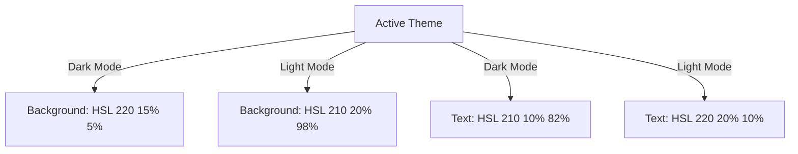

# Color System & Semantic Palette Configuration

## 1. Primary Design Tokens & HSL Variables
The system uses CSS Custom Properties (variables) defined in HSL format to allow easy styling, theme switching, and alpha transparency blending (`hsla`).

```css
:root {
  /* Core Theme Colors */
  --background: 220 15% 5%;       /* Soot Dark Background: #0B0C10 */
  --foreground: 210 10% 82%;      /* Frost White Primary Text: #C5C6C7 */
  
  --card: 215 15% 10%;            /* Obsidian Dark surface: #1F2833 */
  --card-foreground: 210 10% 82%;
  
  --popover: 215 15% 8%;
  --popover-foreground: 210 10% 82%;
  
  /* Semantic Accent Colors */
  --primary: 176 40% 45%;         /* Aurora Turquoise Accent: #45A29E */
  --primary-foreground: 220 15% 5%;
  
  --secondary: 174 85% 70%;       /* Neon Cyan Highlight: #66FCF1 */
  --secondary-foreground: 220 15% 5%;
  
  --muted: 215 10% 30%;
  --muted-foreground: 210 10% 65%;
  
  --accent: 176 40% 15%;
  --accent-foreground: 174 85% 70%;
  
  /* System State Indicators */
  --destructive: 0 85% 60%;       /* Deep Red Error: #EF4444 */
  --destructive-foreground: 210 10% 98%;
  
  --warning: 35 90% 55%;           /* Amber Warning: #F59E0B */
  --warning-foreground: 220 15% 5%;
  
  --success: 142 70% 45%;         /* Emerald Success: #10B981 */
  --success-foreground: 220 15% 5%;
  
  --border: 215 15% 15%;
  --input: 215 15% 12%;
  --ring: 174 85% 70%;
}
```

---

## 2. Light vs. Dark Mode Mapping

To maintain visual comfort across different environments, the platform maps light and dark mode colors to optimize text contrast and reduce eye strain.



---

## 3. Contrast Ratios & Accessibility Compliance
We verify all key color combinations against WCAG 2.1 contrast rules to ensure text remains highly legible.

| Background | Text Color | HSL Combination | Contrast Ratio | WCAG Compliance |
| :--- | :--- | :--- | :--- | :--- |
| **Background** (`#0B0C10`) | **Foreground** (`#C5C6C7`) | `220 15% 5%` vs `210 10% 82%` | **10.2:1** | **AAA** (Passes) |
| **Card Surface** (`#1F2833`) | **Secondary Accent** (`#66FCF1`) | `215 15% 10%` vs `174 85% 70%` | **5.4:1** | **AA** (Passes) |
| **Primary Button** (`#45A29E`) | **Button Text** (`#0B0C10`) | `176 40% 45%` vs `220 15% 5%` | **6.1:1** | **AA** (Passes) |
| **Destructive Background** (`#EF4444`) | **Destructive Text** (`#FFFFFF`) | `0 85% 60%` vs `0 0% 100%` | **4.6:1** | **AA** (Passes) |

---

## 4. Visual Color Tokens Configuration (Tailwind)
```javascript
module.exports = {
  theme: {
    extend: {
      colors: {
        border: "hsl(var(--border))",
        input: "hsl(var(--input))",
        ring: "hsl(var(--ring))",
        background: "hsl(var(--background))",
        foreground: "hsl(var(--foreground))",
        primary: {
          DEFAULT: "hsl(var(--primary))",
          foreground: "hsl(var(--primary-foreground))",
        },
        secondary: {
          DEFAULT: "hsl(var(--secondary))",
          foreground: "hsl(var(--secondary-foreground))",
        },
        success: {
          DEFAULT: "hsl(var(--success))",
          foreground: "hsl(var(--success-foreground))",
        },
      },
    },
  },
}
```
