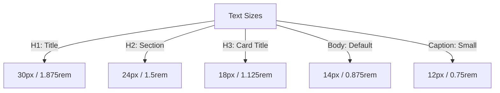

# Typography Guidelines & Font Hierarchy

## 1. Core Font Families

### 1.1. Sans-Serif System (UI & Labels)
The system uses **Inter** (sourced via Google Fonts) as its primary typeface. Inter is optimized for screen legibility, featuring a high x-height that makes short labels and descriptive text easy to read.

*   *CSS Fallback Chain:* `font-family: 'Inter', system-ui, -apple-system, sans-serif;`

### 1.2. Monospace System (Code Workspace)
For the coding workspace, code editor text, logs, and token analytics, the system uses **Fira Code**. Fira Code includes programming ligatures (e.g., `=>`, `!==`, `===`), which help candidates read complex algorithms.

*   *CSS Fallback Chain:* `font-family: 'Fira Code', 'Fira Mono', monospace;`

---

## 2. Font Scales & Hierarchy



### Typography Scale Matrix
The typography scale relies on Tailwind utility classes config tokens:

| Level | Size (rem) | Size (px) | Line Height (Leading) | Weight (Tracking) | Tailwind Class | Primary Usage |
| :--- | :--- | :--- | :--- | :--- | :--- | :--- |
| **Heading 1** | `2.25rem` | 36px | `2.5rem` (tight) | Bold (700) | `text-4xl font-bold` | Main Landing/Dashboard Titles. |
| **Heading 2** | `1.875rem`| 30px | `2.25rem` | Semibold (600) | `text-3xl font-semibold`| Feature Sections, Interview setup page. |
| **Heading 3** | `1.5rem` | 24px | `1.75rem` | Semibold (600) | `text-2xl font-semibold`| Panel Titles, Workspace dividers. |
| **Subheading**| `1.125rem`| 18px | `1.5rem` | Medium (500) | `text-lg font-medium` | Card titles, code parameter options. |
| **Body Large**| `1.0rem` | 16px | `1.5rem` (normal) | Regular (400) | `text-base` | Transcripts and chat dialog blocks. |
| **Body Regular**|`0.875rem`| 14px | `1.25rem` | Regular (400) | `text-sm` | Default inputs, labels, descriptions. |
| **Caption** | `0.75rem` | 12px | `1.0rem` | Light (300) | `text-xs font-light` | Vector scores, runtime memory specs. |

---

## 3. Typography Variables Definition (CSS)
```css
/* Custom typography styles */
.font-sans-ui {
  font-family: 'Inter', -apple-system, BlinkMacSystemFont, "Segoe UI", Roboto, sans-serif;
  letter-spacing: -0.011em;
}

.font-mono-code {
  font-family: 'Fira Code', 'Courier New', Courier, monospace;
  font-variant-ligatures: common-ligatures;
}
```
