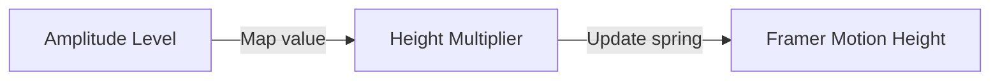

# Animation Guidelines: Framer Motion Transitions

## 1. Animation Curves & Physics Tokens
To create a premium feel, animations avoid abrupt linear transitions in favor of natural, spring-based motion curves.

| Name | Type | Stiffness | Damping | Mass | Primary Use Case |
| :--- | :--- | :---: | :---: | :---: | :--- |
| **Spring Snappy** | Spring | `300` | `20` | `1.0` | Button hovers, small icon micro-interactions. |
| **Spring Smooth** | Spring | `120` | `15` | `1.0` | Sliding panel expansions, modal entries. |
| **Spring Soft** | Spring | `80` | `25` | `1.2` | Page routing fade-slides, dashboard list loading. |
| **Linear Ease** | Tween | - | - | - | Continuous infinite rotating status loaders. |

---

## 2. Framer Motion Component Definitions

### 2.1. Voice Waveform Equalizer
The audio equalizer animates bars of varying heights to visualize voice activity.



#### Code Specification
```typescript
import { motion } from 'framer-motion';

export const VoiceEqualizerBar = ({ isActive, amplitude }: { isActive: boolean; amplitude: number }) => {
  // Map raw voice input levels (0-1) to dynamic height values
  const targetHeight = isActive ? amplitude * 100 : 10;

  return (
    <motion.div
      className="w-1.5 bg-cyan-400 rounded-full"
      animate={{ height: `${targetHeight}%` }}
      transition={{ type: 'spring', stiffness: 200, damping: 15 }}
      style={{ minHeight: '4px', maxHeight: '80px' }}
    />
  );
};
```

### 2.2. Workspace Panel Transitions
Ensures code workspace panels slide and snap smoothly into place when switching view modes.

```typescript
export const panelTransitionVariants = {
  initial: { opacity: 0, scale: 0.97, x: 20 },
  animate: { 
    opacity: 1, 
    scale: 1, 
    x: 0,
    transition: {
      type: 'spring',
      stiffness: 150,
      damping: 18
    }
  },
  exit: { 
    opacity: 0, 
    scale: 0.95, 
    x: -20,
    transition: { duration: 0.2, ease: 'easeOut' }
  }
};
```

---

## 3. Micro-Interactions & Hover Actions
*   **Active Button State:** Scaled down slightly when pressed (`whileTap={{ scale: 0.96 }}`) to provide tactile feedback.
*   **Card Hover Effect:** Translates slightly upward (`y: -4`) and intensifies shadow transparency (`box-shadow: 0 10px 15px -3px rgba(69, 162, 158, 0.2)`) on hover to draw attention.
*   **List Skeleton Shimmer:** A sliding linear gradient animation to guide candidates visually while dashboard statistics load.
