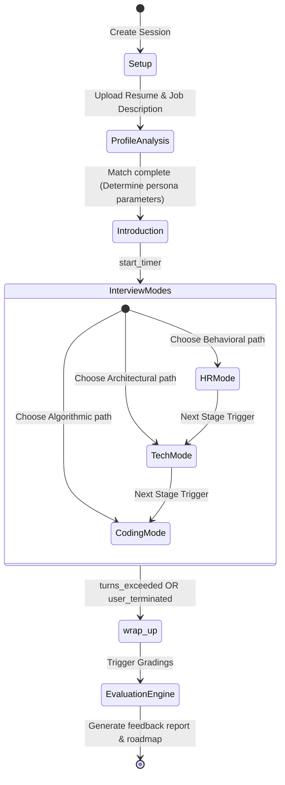
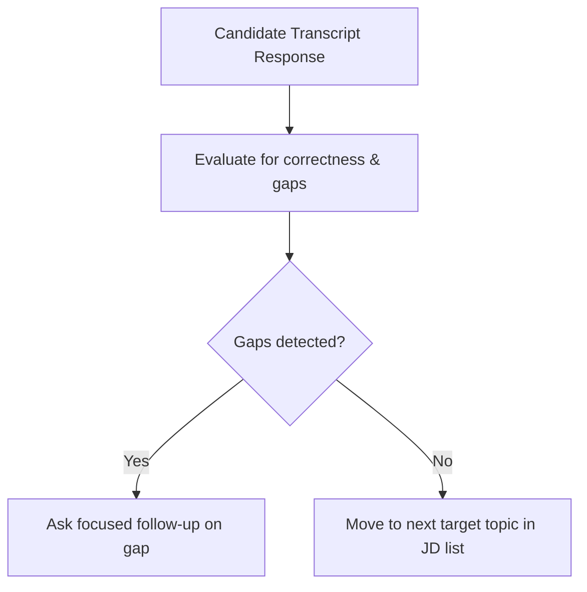

# Interview Flows: State Machine & Conversational Transitions

## 1. Interview Workflow State Machine
The interview session moves through a series of structured stages, starting from initial profile setup to generating the final evaluation report.



---

## 2. Conversational State Transition Rules

### 2.1. Dynamic Follow-up Logic
Instead of using static, pre-written script paths, the system determines the next conversational step dynamically:



*   **Behavioral Follow-up:** If the candidate explains their actions but does not mention the result, the agent asks: *"That explains the process, but what was the final outcome of that change?"*
*   **Technical Follow-up:** If the candidate describes their system design but misses scaling bottlenecks (e.g., locking constraints), the agent asks: *"How would this database locking strategy behave if write volume doubles?"*

---

## 3. Interruption (Barge-in) Recovery Loop
When the candidate interrupts the AI interviewer, the system updates states to ensure the conversation resumes naturally:

1.  **VAD Trigger:** The client-side Voice Activity Detection flags active speech.
2.  **Cancel Signal:** The backend halts downstream TTS voice generation and invalidates the current LLM synthesis session.
3.  **State Rollback:** The session state rolls back to the previous turn, appending the candidate's interruption text to the transcription history:
    ```text
    Interviewer (Partially Synthesized): "We can distribute requests across servers using..."
    Candidate (Interruption): "Actually, let me interrupt. I'd prefer a DNS-based round-robin approach."
    Resolved Context: "Candidate interrupted during explanation to clarify DNS-based preference."
    ```
4.  **Re-Inference:** The AI Gateway generates a new completion that responds directly to the candidate's interruption, maintaining conversational flow.

---

## 4. Interview Wrap-up & Evaluation Trigger
*   **Time Limit Enforcement:** Standard sessions are capped at 45 minutes. When the remaining time reaches 5 minutes, the coordinator warns the candidate: *"We have about five minutes left. Let's start wrapping up this discussion."*
*   **Turn Limits:** Coding challenges are capped at a maximum of 8 conversational turns to keep interviews moving forward.
*   **Final Generation:** After the candidate disconnects or limits are reached, the system sets the session status to `COMPLETED` and queues a background worker to run the feedback engine.
