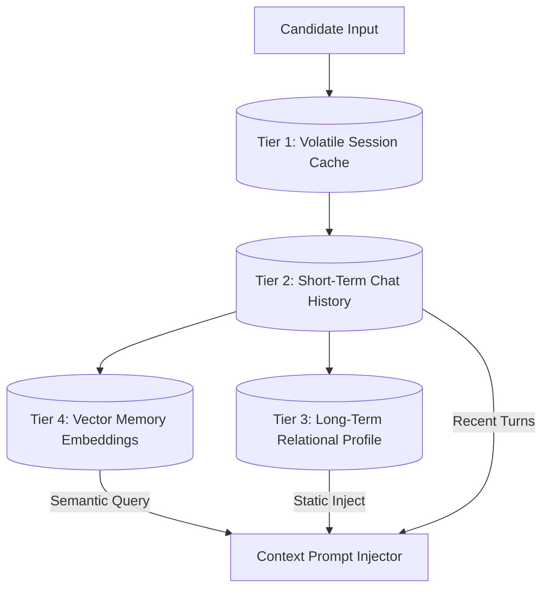
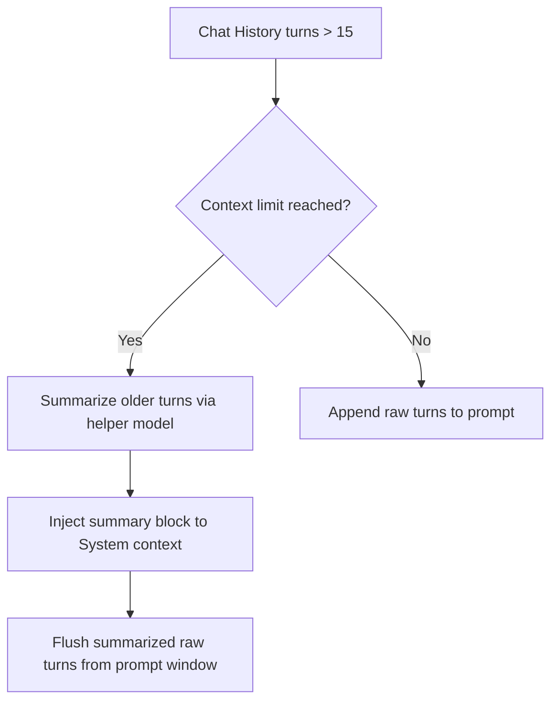

# Conversation Memory: Multi-Tier Storage & Context Injection

## 1. Multi-Tier Memory Model
The platform manages conversation state across four distinct tiers. This approach balances access speed, context window limits, and long-term personalization.



### Memory Tiers Breakdown

#### Tier 1: Session Cache (Redis)
*   **Latency:** < 2ms.
*   **Data Stored:** Current question index, Voice Activity Detection state flags, active code buffer, compiler run histories.
*   **Lifecycle:** Deleted when the session ends.

#### Tier 2: Short-Term Chat History (Node.js Memory / Postgres)
*   **Latency:** < 10ms.
*   **Data Stored:** Text transcripts of the last 10-15 conversation turns.
*   **Lifecycle:** Persisted in the database. Used to provide immediate conversational context.

#### Tier 3: Long-Term Relational Profile (PostgreSQL)
*   **Latency:** < 20ms.
*   **Data Stored:** Overall candidate performance stats, recurring syntax mistakes, communication styles, target role details.
*   **Lifecycle:** Permanent. Used to customize future interview paths.

#### Tier 4: Vector Memory Embeddings (pgvector)
*   **Latency:** < 40ms.
*   **Data Stored:** Semantic vector representations of all past conversation messages.
*   **Lifecycle:** Permanent. Queried during the interview to retrieve relevant details from earlier in the session.

---

## 2. Context Window Compression & Summarization
To prevent exceeding LLM context windows during long conversations, the system uses a dynamic compression pipeline.



*   **Trigger Threshold:** When the active chat history token count reaches `2,500` tokens.
*   **Process:** The system isolates the oldest `10` turns, sends them to a fast helper model to generate a concise summary (e.g., *"Candidate explained their scaling approach, noting a preference for Redis over Memcached because of its built-in persistence features"*), and replaces those raw turns in the context window with the summary.

---

## 3. Dynamic Memory Injection Example
Before generating a response, the system queries pgvector for relevant context from earlier in the session and injects it into the prompt.

```xml
<context_memory>
The candidate previously mentioned the following relevant details. Use this context if they reference past points or if you need to clarify their decisions:
- "The candidate prefers PostgreSQL for transactional data but uses Redis for caching hot product catalogs."
- "The candidate worked with Kubernetes configurations in their last role at TechCorp."
</context_memory>
```
