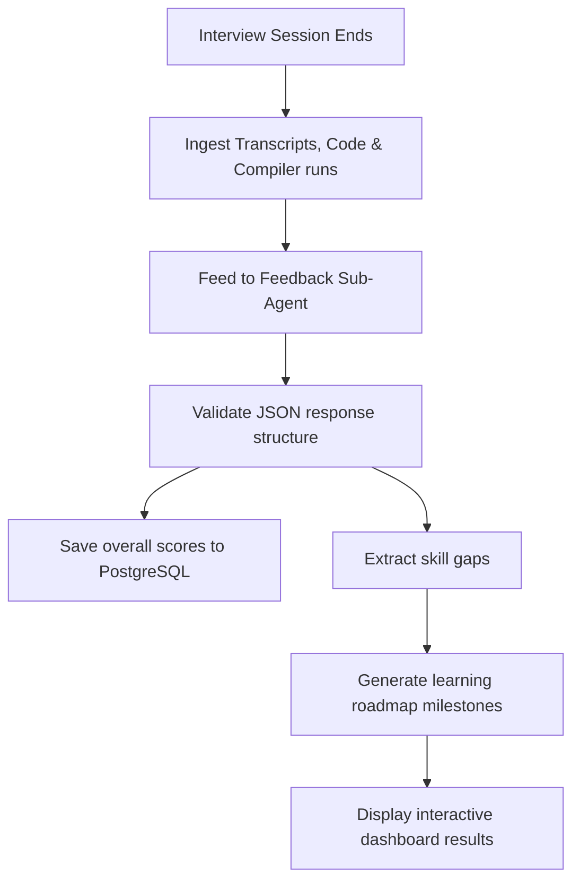

# Feedback Engine: Evaluation Rubrics & Study Plan Generation

## 1. Multi-Dimensional Evaluation Rubric
The platform grades candidates across four key areas using a structured rubric to ensure evaluations are objective and actionable.

| Category | Target Metrics | Score Range | Grading Criteria |
| :--- | :--- | :---: | :--- |
| **Technical Correctness** | Algorithmic accuracy, code structure, handling edge cases. | `0 - 100` | **90+:** Code compiles, passes all test cases, and runs with optimal time complexity.<br>**70-89:** Code compiles, passes primary test cases, but has minor logical bugs or suboptimal performance.<br>**<70:** Code fails to compile or misses critical requirements. |
| **System Architecture**| Scaling decisions, choice of database, trade-off analysis. | `0 - 100` | **90+:** Successfully identifies scaling bottlenecks and justifies architectural choices.<br>**70-89:** Proposes a functional design but struggles to address edge-case failures or justify trade-offs.<br>**<70:** Design fails to scale or relies on incorrect system assumptions. |
| **Behavioral Competency**| STAR structure, collaboration, conflict resolution. | `0 - 100` | **90+:** Responses clearly outline the Situation, Task, Action, and Result, highlighting collaborative decisions.<br>**70-89:** Proposes responses that miss details (e.g., skips the result or fails to clarify their individual actions).<br>**<70:** Fails to follow the STAR structure or demonstrates poor collaboration skills. |
| **Communication Clarity**| Voice pace, structure, use of technical terms. | `0 - 100` | **90+:** Speaks clearly at a natural pace (130-150 words per minute) with well-structured explanations.<br>**70-89:** Explanations are correct but disorganized or delivered too quickly/slowly.<br>**<70:** Struggles to explain technical concepts or relies on repetitive filler words. |

---

## 2. Feedback Evaluation Pipeline



1.  **Ingestion:** The system compiles the session's chat logs, code updates, and compiler results.
2.  **Analysis:** The AI Gateway runs an evaluation prompt using a low-temperature settings model (`temperature: 0.0`) to analyze the candidate's performance.
3.  **JSON Validation:** The system parses the evaluator's JSON response, verifying it matches the target schema before saving the scores to PostgreSQL.
4.  **Roadmap Generation:** The system identifies skill gaps, queries a curated learning resource database, and builds a step-by-step study plan.

---

## 3. Dynamic Learning Roadmap Builder Schema
```json
{
  "summaryEvaluation": "The candidate demonstrated solid algorithmic skills but struggled to explain database locking strategies during the system design portion.",
  "scores": {
    "technical": 84,
    "architecture": 68,
    "behavioral": 90,
    "communication": 85
  },
  "detectedGaps": [
    {
      "topic": "Database Locking & Transaction Isolation Levels",
      "severity": "HIGH",
      "details": "Struggled to explain the difference between Optimistic and Pessimistic locking under heavy write load."
    }
  ],
  "roadmapSteps": [
    {
      "stepOrder": 1,
      "topic": "PostgreSQL Isolation Levels & Locking Mechanics",
      "description": "Read documentation on READ COMMITTED vs SERIALIZABLE levels and practice writing transactional updates.",
      "resourceUrls": [
        "https://www.postgresql.org/docs/current/transaction-iso.html"
      ],
      "targetDays": 5
    }
  ]
}
```
