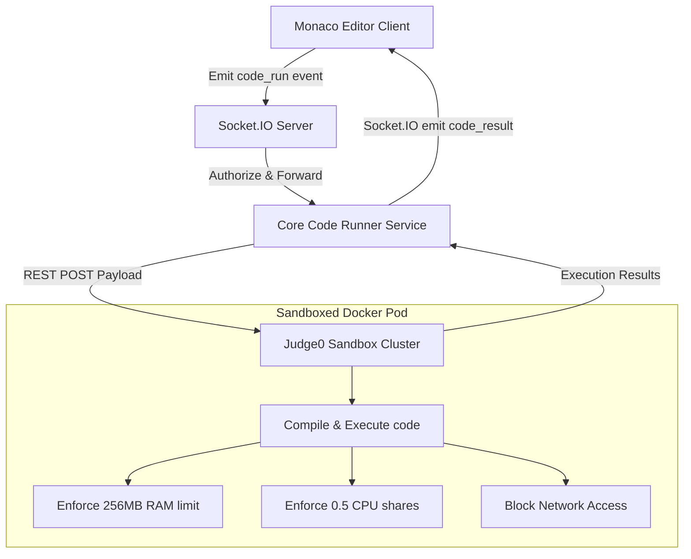

# Coding Engine: Monaco Editor & Judge0 Integration

## 1. Code Execution Flow & Architecture
Candidates write code in a frontend Monaco Editor, which sends updates via WebSockets. The backend coordinates compiler execution using a secure, isolated **Judge0** sandbox instance.



---

## 2. Judge0 REST API Payload Specs
To evaluate code submissions, the backend constructs compile payloads and sends them to the Judge0 router.

### REST API POST Request: `/submissions?wait=true`
*   **Request Headers:**
    *   `Content-Type: application/json`
    *   `Authorization: Bearer <Judge0_API_Key>`
*   **Request Payload:**
```json
{
  "source_code": "ZGVmIGZpbmRfc3VtKGEsIGIpOgogICAgcmV0dXJuIGEgKyBi", -- Base64 encoded code
  "language_id": 71, -- Python 3.8.1
  "stdin": "NSAxMA==", -- Base64 encoded input variables (e.g. "5 10")
  "expected_output": "MTU=", -- Base64 expected results (e.g. "15")
  "cpu_time_limit": 2.0, -- Timeout ceiling in seconds
  "memory_limit": 262144 -- Memory ceiling in kilobytes (256MB)
}
```

---

## 3. Sandbox Security Constraints & Isolation
To prevent malicious code from compromising the host server (e.g., executing system commands or scanning internal networks):
1.  **Network Isolation:** Sandboxes have no access to the external internet or local host networking.
2.  **Resource Limits:** Submissions are capped at 256MB of RAM and 0.5 CPU cores to prevent resource exhaustion attacks.
3.  **Process Sandboxing:** Code runs as a non-privileged `sandbox` user inside a transient Docker container with a read-only root file system, preventing unauthorized writes.

---

## 4. Test Case Schema & Verification Logic
The system supports both visible (helpful feedback) and hidden (objective validation) test cases.

```typescript
export interface TestCase {
  id: string;
  input: string;
  expectedOutput: string;
  isHidden: boolean;
}

export interface VerificationReport {
  testCasesPassed: number;
  totalTestCases: number;
  results: Array<{
    testCaseId: string;
    passed: boolean;
    input: string | null; -- Null if hidden to prevent cheating
    expected: string | null; -- Null if hidden
    actual: string;
    errorMessage: string | null;
  }>;
}
```

*   **Visible Test Cases:** Help candidates debug their approach with clear inputs and expected outputs.
*   **Hidden Test Cases:** Prevent candidates from hardcoding outputs, validating the solution's correctness.
*   **Analysis:** The system compares raw output against target outputs, ignoring trailing whitespace and newline variations.
