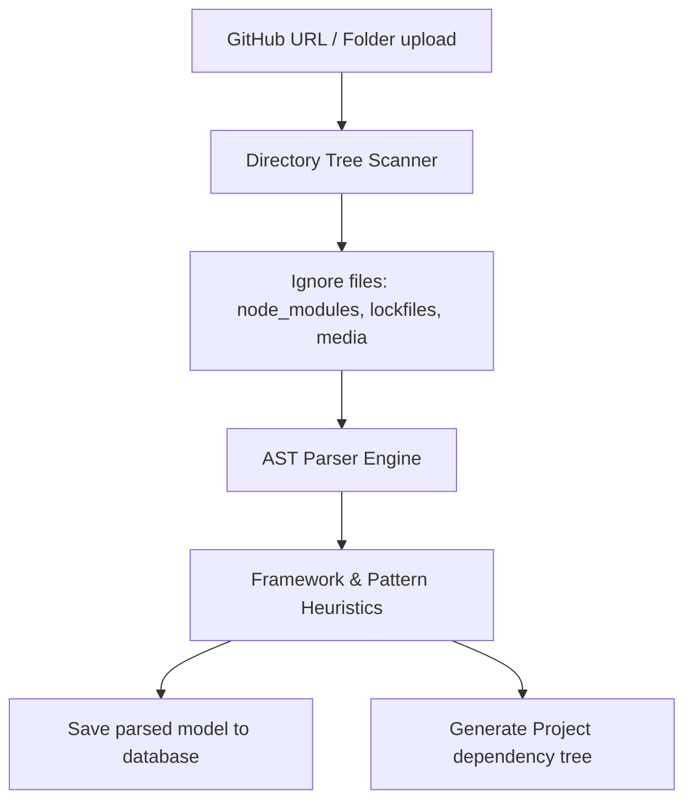

# Project Analyzer: Architecture & Codebase Parser

## 1. Codebase Analysis Workflow
To evaluate a candidate's real-world engineering skills, the platform parses their code repositories. This analysis helps the AI interviewer ask informed questions about their architecture choices, framework usage, and dependency management.



---

## 2. AST (Abstract Syntax Tree) Parsing
For key languages (TypeScript/JavaScript, Python), the analyzer runs AST parsers (such as `@typescript-eslint/typescript-estree` or Python's `ast` module) to extract code structures:

*   **Imports & Dependencies:** Identifies imported libraries to build a complete dependency graph.
*   **Class & Function Definitions:** Extracts class names, functions, parameter signatures, and docstring comments.
*   **API Footprint:** Identifies REST controllers (e.g., matching `@Get()`, `@Post()`, `router.get`) to map application route layouts.

---

## 3. Pattern & Framework Recognition Heuristics
The analyzer scans codebase files for specific markers to detect the frameworks and design patterns used:

*   **React (Frontend):** Matches files containing `import React`, `.tsx` extensions, hooks (e.g., `useState`, `useEffect`), or `package.json` dependencies on `react` or `next`.
*   **Express (Backend):** Matches routes containing `express()`, `app.use(middleware)`, or router configurations.
*   **Clean Architecture / Domain-Driven Design:** Matches folder structures containing `domain`, `application`, `infrastructure`, `repositories`, or `use_cases`.
*   **Repository Pattern:** Identifies classes containing `Repository` suffix (e.g., `UserRepository`) that implement DB CRUD actions.

---

## 4. Visual Project Tree Generation
After parsing, the engine generates a JSON object representing the project tree. This data is used by the frontend to render an interactive map of the codebase.

```json
{
  "root": "src/",
  "frameworksDetected": ["React", "Express"],
  "architecturePattern": "Repository Pattern",
  "tree": {
    "name": "src",
    "type": "directory",
    "children": [
      {
        "name": "domain",
        "type": "directory",
        "children": [
          { "name": "user.ts", "type": "file", "imports": [] }
        ]
      },
      {
        "name": "repositories",
        "type": "directory",
        "children": [
          { "name": "userRepository.ts", "type": "file", "imports": ["domain/user"] }
        ]
      }
    ]
  }
}
```
