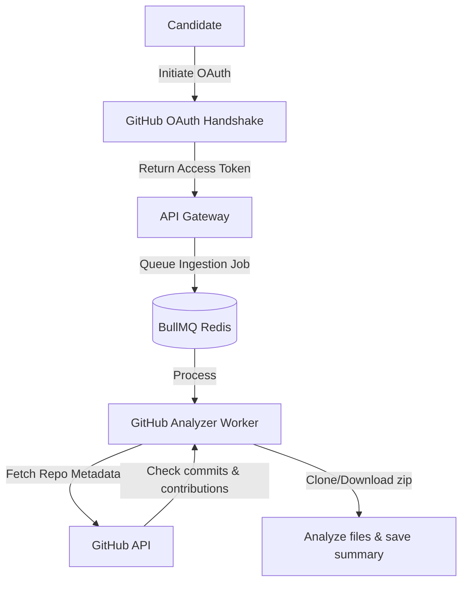

# GitHub Analyzer: API Integration & Repository Ingestion

## 1. GitHub Ingestion Workflow
Candidates can link their GitHub accounts to import repositories directly. This allows the AI interviewer to analyze their project code and contributions before the session starts.



---

## 2. API Integration & Rate Limit Management
To fetch data reliably without exceeding GitHub's API rate limits:

*   **OAuth Scopes:** Request access using minimal scopes: `read:user` and `repo` (for private repositories) or public repository read permissions only.
*   **Token Storage:** Access tokens are encrypted at rest using AES-256-GCM before being stored in the database.
*   **Caching & ETag Headers:** The analyzer uses HTTP conditional requests (`If-None-Match`, `If-Modified-Since`) when querying GitHub. If the data has not changed, GitHub returns a `304 Not Modified` status, which does not count against API rate limits.
*   **Token Refresh Queue:** If rate limits are reached (HTTP 403 / 429), the analyzer worker pauses the active job, schedules a retry after the reset window passes, and logs the delay to Redis.

---

## 3. Repository Crawling Boundaries
To prevent server memory overload when downloading large repositories:
*   **Max Repository Size:** Capped at 50MB. Larger repositories are rejected with an error message: *"Repository exceeds size limit (50MB)."*
*   **File Exclusion Rules (Blacklist):** Files matching vendor or build output patterns are ignored during ingestion:
    ```text
    node_modules/, vendor/, target/, build/, dist/, .git/, 
    package-lock.json, yarn.lock, Cargo.lock, *.png, *.jpg, *.mp4
    ```
*   **Max File Count:** Limits file processing to a maximum of 150 code files per repository, prioritizing core application files (`.js`, `.ts`, `.py`, `.go`, `.java`).

---

## 4. Code Quality Metrics & Heuristics
The analyzer evaluates several metrics to determine the candidate's involvement and coding practices:
*   **Contribution Ratio:** Parses git commit histories to identify the candidate's contribution percentage. If they wrote >80% of the codebase, the repository is flagged as a primary discussion candidate.
*   **Code Complexity Heuristic:** Measures function lengths, nesting depths, and code-to-comment ratios across files to identify complex classes for discussion.
*   **Documentation Coverage:** Evaluates README file detail, architectural descriptions, and API document presence to assess technical writing capabilities.
