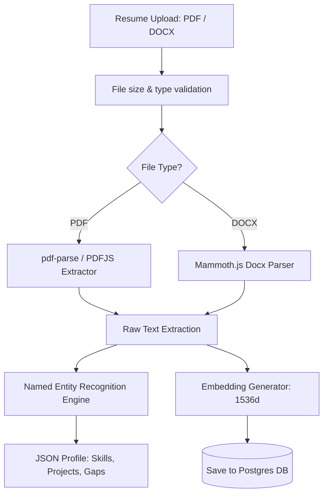

# Resume Parser: PDF & Word Document Intelligence

## 1. Resume Parsing Workflow
To extract candidate profiles, the system runs an ingestion pipeline that handles file conversions, text parsing, and vector embedding generation.



---

## 2. Text Extraction Libraries
*   **PDF Extraction:** We use the `pdf-parse` library to extract plain text from PDFs.
*   **Word (DOCX) Extraction:** We use `mammoth` to extract text from DOCX files, converting document structures (tables, lists) into clean markdown text before parsing.

---

## 3. Named Entity Recognition (NER) & Classification Heuristics
Once text is extracted, a parsing script uses regex patterns and keyword matches to structure the data:

*   **Contact Details Extraction:** Extracts emails, phone numbers, and LinkedIn profiles, sanitizing them to protect candidate privacy before sending data to external AI models.
*   **Skill Classification:** Matches terms against a dictionary of over 5,000 technology keywords, grouping them into categories like Frontend (e.g., React, Vue), Backend (e.g., Node.js, Go), Databases (e.g., PostgreSQL, Redis), and Devops (e.g., Docker, AWS).
*   **Experience Tracking:** Parses company names, job titles, and employment dates to calculate years of experience.

---

## 4. Vector Embedding Generation
The parsed resume text is converted into a 1536-dimensional vector using an embedding model (such as `text-embedding-3-small`), enabling semantic search comparisons against job descriptions.

```typescript
import { OpenAIApi } from 'openai';

export async function generateResumeEmbeddings(parsedText: string): Promise<number[]> {
  const openai = new OpenAIApi({ apiKey: process.env.OPENAI_API_KEY });
  const response = await openai.createEmbedding({
    model: 'text-embedding-3-small',
    input: parsedText,
  });

  return response.data[0].embedding; // Returns 1536-dimensional array
}
```

---

## 5. Handling Scanned Resumes & OCR Fallback
*   **Detection:** If the parsed output contains fewer than 100 characters, the file is flagged as a scanned image rather than a text document.
*   **OCR Fallback:** Scanned resumes are sent to an optical character recognition (OCR) worker (using `tesseract.js`) to extract the text. If OCR fails or returns low-confidence text, the upload is rejected with a message asking the candidate to upload a text-based document.
*   **Execution Safety:** Files are checked for virus signatures using `clamscan` before processing to prevent malicious uploads.
