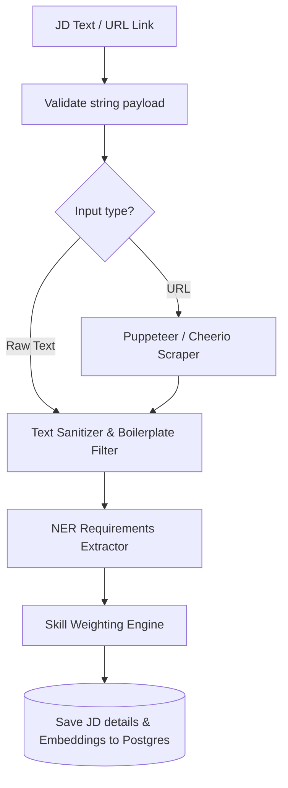

# Job Description (JD) Parser: Crawling & Requirements Indexing

## 1. JD Parsing Workflow
To align interview questions with target role requirements, the platform processes pasted text or job URLs to extract skills, seniority levels, and responsibilities.



---

## 2. Scraping & Content Extraction
If the user inputs a URL instead of raw text, the parsing service runs a crawler to extract the job details:

*   **HTML Scraping:** Uses `cheerio` (for fast static parsing) or `puppeteer` (for single-page JavaScript applications) to download page contents.
*   **Boilerplate Filter:** Cleans the document by removing non-content HTML elements:
    ```text
    nav, footer, script, style, header, aside, .cookie-banner, .footer-links
    ```
*   **Metadata Extraction:** Identifies job titles, company names, and locations using standard JSON-LD schemas embedded in the webpage metadata.

---

## 3. Requirements Extraction & Classification
Once cleaned text is extracted, the service structures the role requirements:

*   **Seniority Classification:** Identifies career levels by searching for terms like *"Junior"*, *"Senior"*, *"Lead"*, *"Principal"*, or experience indicators (e.g., *"5+ years"*).
*   **Hard Skills Extraction:** Extracts tech stack terms (e.g., *"Rust"*, *"Kubernetes"*, *"Kafka"*) using regex patterns.
*   **Soft Skills Extraction:** Identifies soft skill indicators (e.g., *"mentoring junior engineers"*, *"cross-functional collaboration"*).

---

## 4. Multi-Dimensional Weighting Algorithm
To determine which topics to focus on during the interview, the engine calculates weights for each extracted skill:

*   **Frequency Score:** Measures how often a skill term appears in the text.
*   **Position Weight:** Assigns higher weight to skills listed near the top of the "Requirements" or "Tech Stack" sections.
*   **Context Score:** Elevates the importance of skills associated with strong verbs (e.g., *"Expert knowledge in PostgreSQL"* gets higher weight than *"Familiarity with PostgreSQL"*).
*   **Weight Mapping:** Scores skills on a scale of `1` (nice-to-have) to `5` (must-have), adjusting interview focus accordingly.
