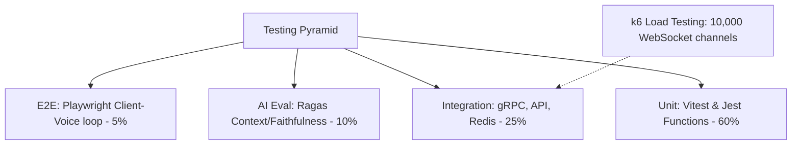
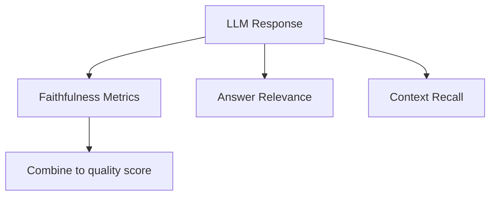

# Testing Strategy: QA Automation & Evaluation Framework

## 1. Enterprise Testing Pyramid
The quality assurance strategy combines automated code verification with specialized evaluations for AI model outputs.



*   **Unit Tests (60%):** Validates helper functions, state machines, and utility classes in isolation.
*   **Integration Tests (25%):** Verifies database queries, API routing, Redis connections, and gRPC communications.
*   **LLM Evaluation (10%):** Audits prompt effectiveness and response quality.
*   **E2E Tests (5%):** Simulates user paths (e.g., login, resume upload, live coding) in real browser environments.

---

## 2. Testing Frameworks & Tooling
*   **Frontend Unit Testing:** Deploys **Vitest** for components, hooks, and Zustand store tests.
*   **Backend Unit & Integration Testing:** Deploys **Jest** or native Node.js runners, mocking external API calls.
*   **E2E Testing:** Deploys **Playwright** to test browser actions, Monaco Editor sync, and WebRTC audio streams.
*   **Load Testing:** Deploys **k6** to simulate user volumes and verify WebSocket channel scaling.

---

## 3. LLM Evaluation Metrics (Ragas Framework)
Because LLM outputs are unstructured, the system uses the **Ragas** framework to evaluate prompt and context quality:



*   **Faithfulness (0-1):** Measures if the generated question is grounded exclusively in the retrieved context, identifying potential hallucinations.
*   **Answer Relevance (0-1):** Measures if the response directly addresses the candidate's last statement.
*   **Context Recall (0-1):** Measures if the retrieval system fetches all the details needed to answer the candidate's question.

---

## 4. k6 Load Testing Configuration
The k6 load test validates WebSocket throughput by simulating concurrent user actions:

```javascript
import ws from 'k6/ws';
import { check, sleep } from 'k6';

export const options = {
  stages: [
    { duration: '1m', target: 500 },  // Ramp up to 500 virtual users
    { duration: '3m', target: 500 },  // Sustained load
    { duration: '1m', target: 0 },    // Cool down
  ],
};

export default function () {
  const url = 'ws://localhost:3000/interview';
  const params = { headers: { 'Authorization': 'Bearer test-token' } };

  ws.connect(url, params, function (socket) {
    socket.on('open', () => {
      // Simulate interview start
      socket.send(JSON.stringify({ event: 'start_session', data: { mode: 'BEHAVIORAL' } }));
    });
    
    socket.on('message', (data) => {
      check(data, { 'message received': (msg) => JSON.parse(msg).event !== null });
    });
    
    sleep(10);
    socket.close();
  });
}
```
