# Performance Guidelines: Latency Budgets & Caching Strategies

## 1. Conversational Latency Budget
To make mock interviews feel natural, the system targets a sub-second response loop. The table below breaks down the latency budget for each step:

```mermaid
gantt
    title Latency Budget (Target: 700ms, Max: 1400ms)
    dateFormat  X
    axisFormat %s
    
    STT chunking           :active, stt, 0, 150
    Prompt & Memory        :active, prompt, 150, 250
    LLM Token Generation   :active, llm, 250, 450
    TTS Voice Synthesis    :active, tts, 450, 600
    Network & Buffer Playback:active, play, 600, 700
```

| Step | Component | Action | Target Latency | Max Limit |
| :--- | :--- | :--- | :---: | :---: |
| **1** | Speech-to-Text | Processes user audio input chunks. | `150ms` | `300ms` |
| **2** | Context Retrieval | Queries pgvector database for relevant history. | `100ms` | `200ms` |
| **3** | LLM Inference | Generates the first token of the text response. | `200ms` | `400ms` |
| **4** | Voice Synthesis | Converts the text response to streaming audio. | `150ms` | `300ms` |
| **5** | Network Playback | Delivers audio chunks to the browser player. | `100ms` | `200ms` |
| **Total**| **Conversational Loop**| **Complete conversational turn** | **700ms** | **1400ms** |

---

## 2. Database Performance Tuning (PostgreSQL & pgvector)
To maintain fast query response times as user volume scales:

*   **HNSW Index Configuration:** We use HNSW vector indexing (`m = 16`, `ef_construction = 64`) to speed up semantic searches over resumes and chat histories.
*   **Connection Pooling:** We use connection pooling (such as `PgBouncer`) configured with a pool size of 50 connections per API pod. This prevents database degradation during high-traffic windows by reusing active sockets.
*   **Index-Level Cache Warming:** We allocate 25% of Postgres memory (`shared_buffers`) to cache active indexes in RAM, keeping vector searches below 30ms.

---

## 3. Caching Strategy (Redis Key Layout)
We use Redis to store frequently accessed data and transient session states:

*   **Session Token Cache:** Stores user JWT validation structures (`TTL: 15 minutes`) to avoid database lookups on every request.
*   **Dynamic Prompt Cache:** Stores static prompt templates and system directives, saving system memory.
*   **TTS Chunk Caching:** Caches common synthesized audio phrases (such as *"Great, let's start. Please summarize your background."*) to bypass voice synthesis pipelines entirely.

---

## 4. Network and Streaming Optimizations
*   **Inference-to-Speech Streaming:** The system streams LLM outputs in real-time, feeding text tokens directly into the Text-to-Speech engine as they generate, rather than waiting for the entire paragraph to complete.
*   **WebRTC Media Protocol:** We use WebRTC for voice streaming to bypass TCP connection overhead, reducing packet delay and jitter.
*   **HTTP/2 Multiplexing:** Enables concurrent delivery of assets, dashboard data, and Monaco Editor sync packets over a single connection.
*   **CDN Optimization:** We configure Cloudflare edge nodes to route user traffic dynamically to the nearest regional host, reducing network latency.
