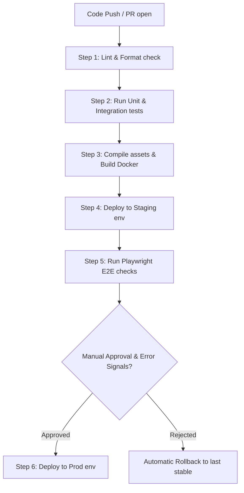

# CI/CD Guide: Automated Pipelines & Deployment Gates

## 6. As-Built: InterviewPilot GitHub Actions (Phase 12)
The production pipeline (`.github/workflows/ci.yml`) is intentionally simple for a
single-user free-tier app — validation-only, with deploy handled by each host's
native git integration.

*   **Jobs (run on push/PR to `main`, one job set per workspace):**
    1. `backend` — `npm ci` + `npm run build` (TypeScript compile gate) in `backend/`.
    2. `frontend` — `npm ci` + `npm run lint` (oxlint) + `npm run build` (tsc -b && vite) in `frontend/`.
    3. `dockerfile` — `docker build` of `backend/Dockerfile` (context: repo root) and
       `backend/Dockerfile.render` (context: `backend/`), plus `bash -n` on
       `backend/supervisor.sh`. This verifies the Render artifact compiles locally
       in CI even though Docker is not available on the dev machine.
*   **Concurrency:** per-ref `concurrency` group cancels superseded runs.
*   **Deploy (no GitHub Action needed):**
    *   **Render** auto-deploys via Blueprint `autoDeployTrigger: commit` on `main`
        (see `docs/39_Deployment_Guide.md` §5).
    *   **Vercel** auto-deploys via its git integration once the repo is imported
        (Phase 13).
*   **Not yet wired (future):** test job (no test suite until Phase 15), staging
    environment, canary/rollback — the §1–§3 vision is aspirational; single-user
    production runs straight from `main`.

## 1. Automated Delivery Pipeline
The platform uses automated CI/CD pipelines (via GitHub Actions) to run checks, compile code, build Docker images, and deploy services to staging and production environments.



---

## 2. GitHub Actions Workflow Configuration
Create the following workflow configuration file at `.github/workflows/deploy.yml`:

```yaml
name: Enterprise Build & Deploy Pipeline

on:
  push:
    branches: [ main, staging ]
  pull_request:
    branches: [ main, staging ]

jobs:
  validate:
    runs-on: ubuntu-latest
    steps:
      - name: Checkout Code
        uses: actions/checkout@v3

      - name: Setup Node.js
        uses: actions/setup-node@v3
        with:
          node-version: 20.x
          cache: 'npm'

      - name: Install Dependencies
        run: npm ci

      - name: Run Linter & Formatter
        run: npm run lint

      - name: Run Unit Tests
        run: npm run test

  deploy-staging:
    needs: validate
    if: github.ref == 'refs/heads/staging'
    runs-on: ubuntu-latest
    steps:
      - name: Deploy to Railway Staging
        uses: bervProject/railway-deploy@v1
        with:
          railway_token: ${{ secrets.RAILWAY_STAGING_TOKEN }}

  deploy-production:
    needs: validate
    if: github.ref == 'refs/heads/main'
    runs-on: ubuntu-latest
    steps:
      - name: Deploy to Railway Production
        uses: bervProject/railway-deploy@v1
        with:
          railway_token: ${{ secrets.RAILWAY_PROD_TOKEN }}
```

---

## 3. Production Deployment Gates & Rollbacks
*   **Manual Gates:** Deployments to production must be approved by at least one lead engineer in the GitHub repository.
*   **Canary Deployments:** Production builds are rolled out gradually, routing 10% of user traffic to the new version initially and increasing volume over one hour.
*   **Automated Rollback Rules:** The gateway monitors system error logs. If the error rate spikes above 2% or API latency increases by more than 20% during rollout, the deployment is canceled and traffic is routed back to the last stable version.
*   **Pipeline Secrets:** Sensitive credentials (such as API tokens and certificates) are stored in GitHub Secrets and injected into container contexts during build steps.
