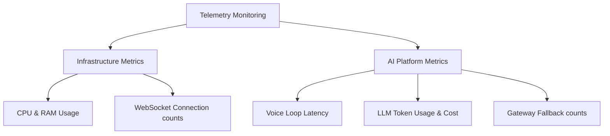

# Monitoring: Telemetry, Metrics & Alert Thresholds

## 1. Key Performance Indicators (KPIs)
To keep the system running smoothly, we monitor both infrastructure metrics and AI performance indicators.



### 1.1. Infrastructure Metrics
*   **CPU & RAM Utilization:** Target container usage remains below `70%`.
*   **WebSocket Connection Counts:** Monitors concurrent active connections across API pods.
*   **Database Pool Utilization:** Tracks active PostgreSQL connections to prevent pool exhaustion.

### 1.2. AI Platform Metrics
*   **Voice Loop Latency (P95):** Target latency remains below `1.4s` for conversational turns.
*   **Gateway Fallback Rates:** Tracks how often the system redirects requests to fallback models.
*   **LLM API Cost Metering:** Logs cumulative token spend to monitor operating costs.

---

## 2. OpenTelemetry Integration
We use OpenTelemetry to trace requests across microservices and measure performance bottlenecks.

```typescript
import { NodeSDK } from '@opentelemetry/sdk-node';
import { getNodeAutoInstrumentations } from '@opentelemetry/auto-instrumentations-node';
import { OTLPTraceExporter } from '@opentelemetry/exporter-trace-otlp-grpc';

const sdk = new NodeSDK({
  traceExporter: new OTLPTraceExporter({
    url: process.env.OTEL_EXPORTER_OTLP_ENDPOINT || 'http://localhost:4317'
  }),
  instrumentations: [getNodeAutoInstrumentations()]
});

// Start tracing SDK lifecycle
sdk.start();
```

---

## 3. Alerting Threshold Rules
We set alerting rules in Datadog or Prometheus to notify engineering teams of issues:

| Metric | Evaluation Window | Warning Threshold | Critical Threshold | Action Required |
| :--- | :--- | :--- | :--- | :--- |
| **API Error Rate** | 2 minutes | `> 1.0%` errors | `> 3.0%` errors | PagerDuty notification to On-Call Engineer. |
| **P95 Latency** | 5 minutes | `> 1.2s` latency | `> 2.0s` latency | Scaler increases container capacity automatically. |
| **Pod CPU Usage** | 5 minutes | `> 75%` CPU | `> 90%` CPU | Container orchestrator provisions extra backend pods. |
| **Gateway Fallback Count**| 5 minutes | `> 5` fallbacks | `> 15` fallbacks | Alert triggers; team inspects primary AI provider status. |
