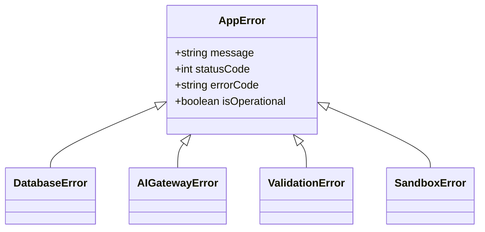

# Error Handling: Application Exceptions & Voice Fallbacks

## 1. Exception Class Hierarchy
The application uses a custom error hierarchy extending the base JavaScript `Error` class. This approach ensures consistent error reporting across all application modules.



### Code Implementation: `errors.ts`
```typescript
export class AppError extends Error {
  public readonly statusCode: number;
  public readonly errorCode: string;
  public readonly isOperational: boolean;

  constructor(message: string, statusCode: number, errorCode: string, isOperational = true) {
    super(message);
    this.statusCode = statusCode;
    this.errorCode = errorCode;
    this.isOperational = isOperational;
    Error.captureStackTrace(this, this.constructor);
  }
}

export class DatabaseError extends AppError {
  constructor(message = 'Database operation failed') {
    super(message, 500, 'ERR_DB_FAILURE');
  }
}

export class AIGatewayError extends AppError {
  constructor(message = 'AI Provider request failed') {
    super(message, 502, 'ERR_AI_GATEWAY_FAILURE');
  }
}
```

---

## 2. Global Error Handling Middleware (Express)
```typescript
import { Request, Response, NextFunction } from 'express';
import { AppError } from './errors';
import { logger } from '../utils/logger';

export const globalErrorHandler = (
  err: Error,
  req: Request,
  res: Response,
  next: NextFunction
) => {
  const correlationId = req.headers['x-correlation-id'] || 'anonymous';
  
  if (err instanceof AppError) {
    logger.warn({ message: err.message, errorCode: err.errorCode, correlationId });
    return res.status(err.statusCode).json({
      status: 'error',
      errorCode: err.errorCode,
      message: err.message
    });
  }

  // Handle unexpected system errors
  logger.error({ message: 'Unhandled exception occurred', error: err.stack, correlationId });
  return res.status(500).json({
    status: 'error',
    errorCode: 'ERR_INTERNAL_SERVER_ERROR',
    message: 'An unexpected error occurred. Please try again.'
  });
};
```

---

## 3. Conversational Voice Fallback Phrases
If a service fails during an active voice interview (e.g., an LLM times out), the Voice Engine plays a polite fallback phrase to keep the session conversational:

*   **AI Inference Timeout:** *"I'm having trouble connecting to my system right now. Let's try again in a few seconds."*
*   **Speech-to-Text Failure:** *"I didn't quite catch that. Could you repeat your last point?"*
*   **Code Sandbox Crash:** *"It looks like the sandbox is having trouble running your code. Let's look over the logic together."*
*   **WebSocket Disconnection:** Client auto-reconnects, and the browser flashes: `Reconnecting voice channel...`
