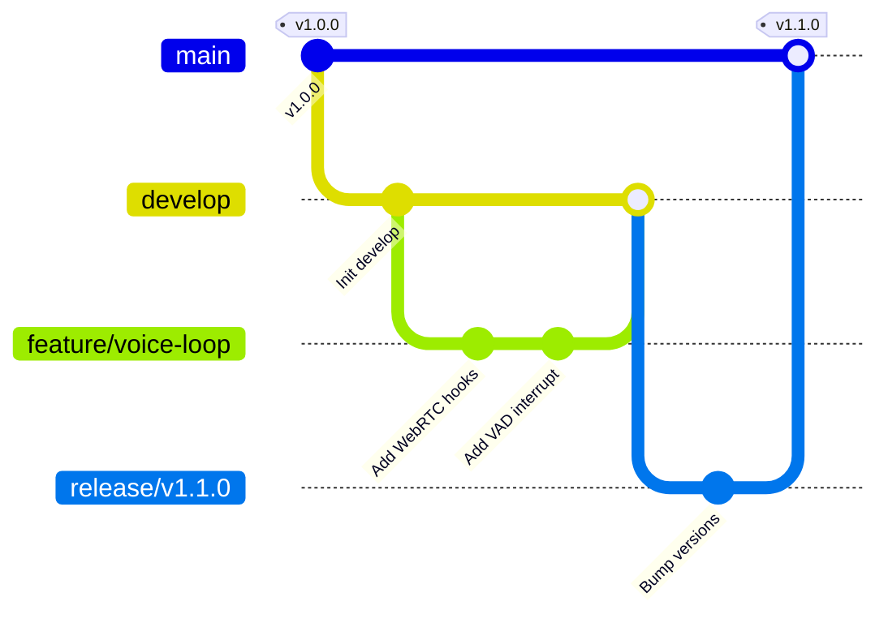

# Developer Guide: Onboarding & Engineering Standards

## 1. Coding Standards & Linter Configurations
To maintain code quality across the team, we enforce strict TypeScript rules, style guidelines, and formatting checks:

*   **TypeScript Formatting:** Enforces strict type declarations; the use of `any` types is prohibited unless explicitly justified in code comments.
*   **Code Style Rules:**
    *   Variables and functions use `camelCase` (e.g., `calculateMatchScore`).
    *   Classes and Interfaces use `PascalCase` (e.g., `AIProviderFactory`).
    *   Constants use `UPPER_SNAKE_CASE` (e.g., `MAX_TOKEN_BUDGET`).
*   **Linter Rules (ESLint):** Code quality is validated using `eslint-config-airbnb-typescript` and `plugin:@typescript-eslint/recommended`.
*   **Code Formatting (Prettier):** Code style is enforced using a standard config file:
```json
{
  "semi": true,
  "trailingComma": "none",
  "singleQuote": true,
  "printWidth": 100,
  "tabWidth": 2
}
```

---

## 2. Git Branch Strategy & Commit Messages
We use a **Git Flow** variant to manage feature development and releases.



### 2.1. Branch Naming Conventions
*   `feature/feature-name`: New feature development (e.g., `feature/webrtc-audio-engine`).
*   `bugfix/bug-details`: Bug fixes (e.g., `bugfix/monaco-typing-delay`).
*   `hotfix/issue-description`: Immediate production fixes (e.g., `hotfix/expired-jwts`).

### 2.2. Conventional Commit Messages
Commits must follow the **Conventional Commits** specification:
*   *Format:* `<type>(<scope>): <short description>`
*   *Types:*
    *   `feat`: A new feature (e.g., `feat(voice): add client-side VAD listener`).
    *   `fix`: A bug fix (e.g., `fix(auth): update refresh token rotation validation`).
    *   `docs`: Documentation changes (e.g., `docs(api): update OpenAPI specs`).
    *   `test`: Adding or updating tests (e.g., `test(gateway): add k6 WebSocket load test`).

---

## 3. Pull Request Review Checklist
Before a Pull Request is approved and merged into the target branch:
1.  **Tests Pass:** All unit and integration tests must pass.
2.  **Lint Check Pass:** The build pipeline must run clean with zero linter errors.
3.  **Documentation Updated:** Relevant documentation files (such as API definitions or READMEs) must be updated.
4.  **Security Review:** The PR must not introduce credentials or security holes.
5.  **Review Approvals:** The changes must be reviewed and approved by at least one Senior or Principal Engineer.
